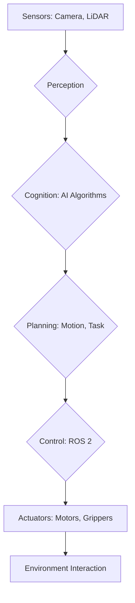

import Admonition from '@theme/Admonition';

# Chapter 1: Introduction to Physical AI and Embodied Intelligence

Welcome to the exciting world where artificial intelligence meets the physical realm. This chapter will introduce you to the core concepts of Physical AI and Embodied Intelligence, laying the groundwork for understanding how intelligent systems can interact with and learn from our physical world.

## What is Physical AI?

Physical AI refers to artificial intelligence systems that operate within and directly interact with the physical environment. Unlike traditional AI, which often exists solely in digital spaces, Physical AI embodies intelligence in physical forms such as robots, drones, and autonomous vehicles. This interaction necessitates a deep understanding of physics, real-time control, and sensor data processing.

<Admonition type="note" title="Key Distinction">
Traditional AI often focuses on cognitive tasks like natural language processing or image recognition. Physical AI extends this by adding the dimensions of physical presence, movement, and interaction.
</Admonition>

## Embodied Intelligence

Embodied intelligence is a sub-field of AI that emphasizes the role of a physical body and its interaction with the environment in the development of intelligence. The idea is that an agent's intelligence is not solely a product of its brain, but also of its body and its experiences in the world.

### The Importance of Embodiment

- **Grounding**: Embodiment helps ground abstract concepts in concrete physical experiences.
- **Interaction**: Physical interaction allows for manipulation, exploration, and learning through trial and error.
- **Perception**: A physical body provides unique perspectives and sensory inputs crucial for understanding the environment.

<Admonition type="tip" title="Think about it">
Consider how a baby learns about the world. It doesn't just process information; it touches, grasps, falls, and experiments, building intelligence through embodied experiences.
</Admonition>

## Historical Context and Evolution

The concept of intelligent machines interacting with the physical world dates back to early cybernetics. However, recent advancements in robotics, machine learning, and computational power have accelerated the field of Physical AI.

### Milestones in Embodied AI

- **Early Robotics**: Simple manipulators and industrial robots.
- **Reactive Architectures**: Subsumption architecture by Rodney Brooks.
- **Learning-based Robotics**: Reinforcement learning for control and manipulation.
- **Humanoid Robotics**: Development of robots mimicking human form and capabilities.

## Components of Physical AI Systems

A typical Physical AI system integrates several key components:

1.  **Perception**: Sensors (cameras, LiDAR, force sensors) to gather data from the environment.
2.  **Cognition**: AI algorithms (machine learning, planning) to process sensor data and make decisions.
3.  **Action**: Actuators (motors, grippers) to execute physical movements.
4.  **Control**: Software frameworks (like ROS 2) to manage and coordinate these components.

## Example: A Simple Robotic Arm Control

Let's consider a basic example of controlling a robotic arm to pick up an object. This involves:

-   **Perception**: A camera identifies the object's position.
-   **Cognition**: An AI algorithm determines the arm's trajectory to reach and grasp the object.
-   **Action**: Motors in the arm move it to the calculated position.
-   **Control**: ROS 2 nodes communicate between the camera driver, the AI planner, and the arm's motor controllers.

```python
# Basic ROS 2 Python example (conceptual)
import rclpy
from rclpy.node import Node
from geometry_msgs.msg import PoseStamped

class ArmController(Node):
    def __init__(self):
        super().__init__('arm_controller')
        self.publisher_ = self.create_publisher(PoseStamped, 'target_pose', 10)
        self.get_logger().info('Arm Controller Node Started')

    def move_arm_to_pose(self, x, y, z):
        msg = PoseStamped()
        msg.header.frame_id = 'base_link'
        msg.pose.position.x = x
        msg.pose.position.y = y
        msg.pose.position.z = z
        self.publisher_.publish(msg)
        self.get_logger().info(f'Published target pose: ({x}, {y}, {z})')

def main(args=None):
    rclpy.init(args=args)
    arm_controller = ArmController()
    arm_controller.move_arm_to_pose(0.5, 0.1, 0.3) # Example target pose
    rclpy.spin_once(arm_controller, timeout_sec=1.0)
    arm_controller.destroy_node()
    rclpy.shutdown()

if __name__ == '__main__':
    main()
```

## Future of Physical AI

The field is rapidly evolving, with trends towards more autonomous, adaptable, and human-like robots. The integration of advanced AI models, such as large language models (LLMs) and vision-language-action (VLA) models, promises robots that can understand complex commands, learn new skills, and operate in unstructured environments.



Next Chapter → [The Robotic Nervous System – ROS 2 Deep Dive](/docs/chapters/chapter-2)