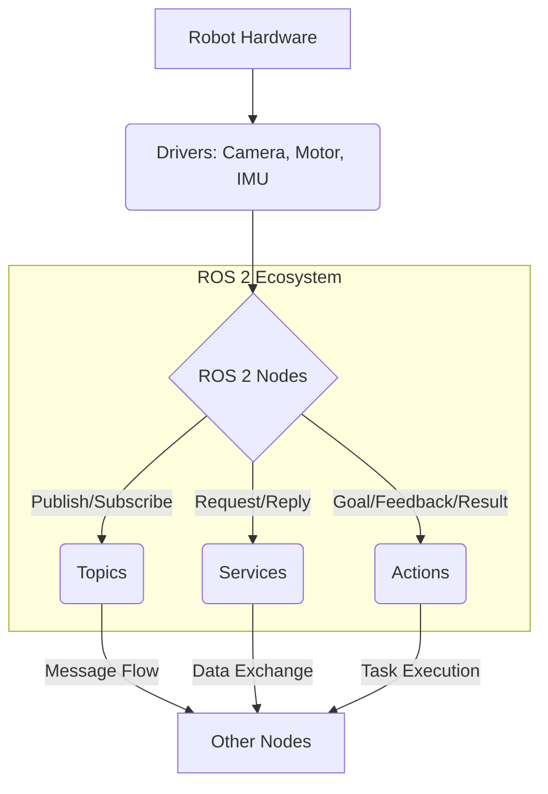

import Admonition from '@theme/Admonition';

# Chapter 2: The Robotic Nervous System – ROS 2 Deep Dive

In the world of robotics, the Robot Operating System (ROS) acts as the central nervous system, providing libraries and tools to help software developers create robot applications. This chapter will take a deep dive into ROS 2, its architecture, core concepts, and how it facilitates the development of complex robotic systems.

## What is ROS 2?

ROS 2 is an open-source, meta-operating system for robots. It provides a flexible framework for writing robot software. It's a collection of tools, libraries, and conventions that aim to simplify the task of creating complex and robust robot behavior across a wide variety of robotic platforms.

<Admonition type="note" title="Evolution from ROS 1">
ROS 2 was re-architected from ROS 1 to address the needs of modern robotics, including support for multiple robots, real-time control, and embedded systems, making it more suitable for production-level deployments.
</Admonition>

## ROS 2 Core Concepts

Understanding ROS 2 begins with grasping its fundamental concepts:

### 1. Nodes

Nodes are executable processes that perform computation. They are designed to be modular, with each node responsible for a single purpose (e.g., a camera driver node, a motor control node, a path planning node).

### 2. Topics

Topics are named buses over which nodes exchange messages. A node can publish messages to a topic, and other nodes can subscribe to that topic to receive the messages. This publish/subscribe mechanism is asynchronous and decoupled.

### 3. Services

Services provide a request/reply mechanism between nodes. Unlike topics, which are one-way streams, services allow nodes to send a request and receive a single response. This is useful for functionalities that require a direct answer, like triggering a specific action.

### 4. Actions

Actions are similar to services but provide long-running, goal-oriented interactions. They allow clients to send a goal, receive continuous feedback, and cancel the goal. This is ideal for tasks like navigating to a specific location or performing a complex manipulation.

### 5. Parameters

Parameters are values that nodes can load at startup or modify during runtime. They are used to configure a node's behavior without recompiling the code.

<Admonition type="tip" title="Modular Design">
The beauty of ROS 2 lies in its modularity. You can combine different nodes, written in different languages, to create complex robot behaviors without worrying about low-level communication details.
</Admonition>

## ROS 2 Architecture Overview



## Practical Example: Creating a Simple ROS 2 Publisher and Subscriber

Let's create a simple Python example of two ROS 2 nodes: a talker (publisher) and a listener (subscriber).

### Publisher Node (`simple_publisher.py`)

```python
import rclpy
from rclpy.node import Node
from std_msgs.msg import String

class SimplePublisher(Node):
    def __init__(self):
        super().__init__('simple_publisher')
        self.publisher_ = self.create_publisher(String, 'my_topic', 10)
        timer_period = 1.0  # seconds
        self.timer = self.create_timer(timer_period, self.timer_callback)
        self.i = 0
        self.get_logger().info('Simple Publisher Node Started')

    def timer_callback(self):
        msg = String()
        msg.data = f'Hello ROS 2: {self.i}'
        self.publisher_.publish(msg)
        self.get_logger().info(f'Publishing: "{msg.data}"')
        self.i += 1

def main(args=None):
    rclpy.init(args=args)
    simple_publisher = SimplePublisher()
    rclpy.spin(simple_publisher)
    simple_publisher.destroy_node()
    rclpy.shutdown()

if __name__ == '__main__':
    main()
```

### Subscriber Node (`simple_subscriber.py`)

```python
import rclpy
from rclpy.node import Node
from std_msgs.msg import String

class SimpleSubscriber(Node):
    def __init__(self):
        super().__init__('simple_subscriber')
        self.subscription = self.create_subscription(
            String,
            'my_topic',
            self.listener_callback,
            10)
        self.subscription  # prevent unused variable warning
        self.get_logger().info('Simple Subscriber Node Started')

    def listener_callback(self, msg):
        self.get_logger().info(f'I heard: "{msg.data}"')

def main(args=None):
    rclpy.init(args=args)
    simple_subscriber = SimpleSubscriber()
    rclpy.spin(simple_subscriber)
    simple_subscriber.destroy_node()
    rclpy.shutdown()

if __name__ == '__main__':
    main()
```

To run these examples:

1.  Save the code into a ROS 2 package.
2.  Run the publisher: `ros2 run your_package_name simple_publisher`
3.  Run the subscriber in another terminal: `ros2 run your_package_name simple_subscriber`

## Interfacing with Hardware

ROS 2 provides various packages and drivers to interface with different robotic hardware components. This allows developers to abstract away low-level hardware communication and focus on high-level robot behaviors.

### Common Hardware Interfaces:

-   **Sensors**: Cameras, LiDARs, IMUs, Encoders.
-   **Actuators**: Motors, Servos, Grippers.
-   **Robotic Arms**: Universal Robots, Franka Emika.
-   **Mobile Platforms**: TurtleBot, custom wheeled robots.

Next Chapter → [Digital Twins – Simulation with Gazebo & Unity](/docs/chapters/chapter-3)