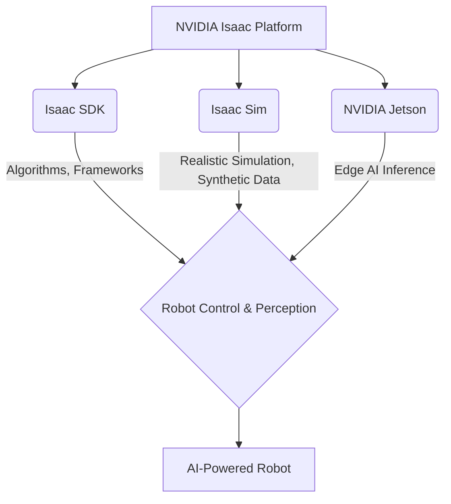

import Admonition from '@theme/Admonition';

# Chapter 4: NVIDIA Isaac Platform – The AI Brain for Robots

To build truly intelligent and autonomous robots, powerful computational platforms are essential. NVIDIA's Isaac platform provides a comprehensive suite of tools, SDKs, and hardware acceleration to develop, simulate, and deploy AI-powered robots. This chapter will delve into the various components of the NVIDIA Isaac platform and how it serves as the AI brain for modern robotics.

## What is NVIDIA Isaac?

NVIDIA Isaac is a robotics platform that accelerates the development and deployment of AI-enabled robots. It combines NVIDIA's expertise in AI, graphics, and simulation to provide developers with a powerful ecosystem for creating the next generation of autonomous machines.

<Admonition type="note" title="Integrated Ecosystem">
Isaac is not just a software toolkit; it's a holistic platform encompassing hardware (Jetson, RTX GPUs), software (SDKs, simulation tools), and a rich ecosystem for robotics development.
</Admonition>

## Key Components of the Isaac Platform

### 1. Isaac SDK

The Isaac SDK is a software development kit that provides a collection of algorithms, frameworks, and tools for robot perception, navigation, and manipulation. It's built on a modular architecture, allowing developers to integrate various AI capabilities into their robotic applications.

### 2. Isaac Sim

Isaac Sim is a scalable robotics simulation application built on NVIDIA Omniverse. It provides a physically accurate virtual environment for developing, testing, and training AI-powered robots. With Isaac Sim, developers can create realistic digital twins of robots and their environments, enabling rapid iteration and synthetic data generation.

### 3. NVIDIA Jetson Platform

Jetson is a series of embedded computing boards designed for AI at the edge. These compact, power-efficient modules bring GPU-accelerated AI capabilities directly to robots, enabling real-time perception, inference, and control onboard the robot itself.

### 4. Omniverse

NVIDIA Omniverse is a platform for 3D design collaboration and simulation. Isaac Sim leverages Omniverse to provide a rich, physically accurate simulation environment. It allows for seamless data exchange and collaboration between different 3D tools and applications.

<Admonition type="tip" title="Unified Development">
The Isaac platform aims to unify the development workflow from design and simulation to deployment, reducing friction and accelerating innovation in robotics.
</Admonition>

## Isaac Sim for Synthetic Data Generation

One of the most powerful features of Isaac Sim is its ability to generate synthetic data. Training AI models with real-world data can be expensive and time-consuming. Isaac Sim allows developers to create vast amounts of diverse, labeled data in a virtual environment, which can then be used to train robust AI models for real-world deployment.

### Why Synthetic Data?

- **Scalability**: Generate millions of diverse data samples rapidly.
- **Annotation**: Perfect, pixel-level annotations are automatically available.
- **Variety**: Easily simulate rare events or extreme conditions.
- **Cost-Effective**: Reduce the need for manual data collection and labeling.

## Example: AI Navigation with Isaac SDK (Conceptual)

Imagine a robot navigating an indoor environment. The Isaac SDK provides components for:

-   **SLAM (Simultaneous Localization and Mapping)**: Using sensors like LiDAR to build a map of the environment while simultaneously locating the robot within it.
-   **Path Planning**: Algorithms to determine an optimal, collision-free path from the robot's current location to a target destination.
-   **Obstacle Avoidance**: Real-time adjustments to the path based on dynamic obstacles detected by sensors.

## Deployment with Isaac

Once developed and tested in simulation, robotic applications can be deployed to physical robots using the Isaac SDK and Jetson platforms. The seamless integration allows for a smooth transition from virtual prototyping to real-world operation.

Next Chapter → [Vision-Language-Action (VLA) Models](/docs/chapters/chapter-5)