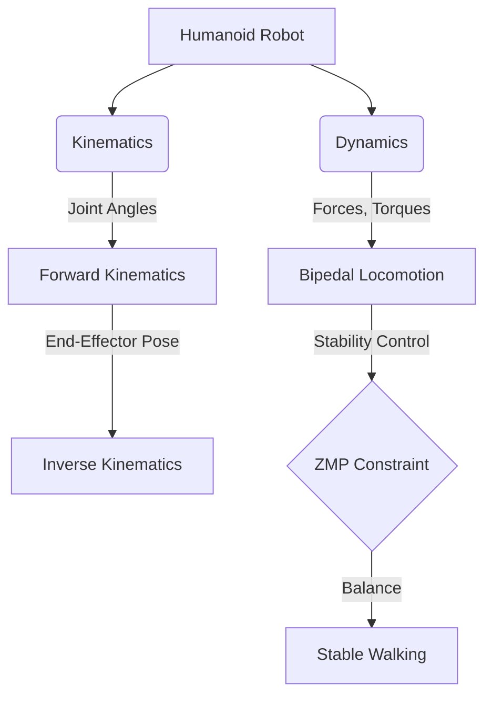

import Admonition from '@theme/Admonition';

# Chapter 6: Humanoid Kinematics and Bipedal Locomotion

Humanoid robots, with their human-like form, represent a grand challenge in robotics. Enabling them to move gracefully and stably on two legs, and interact dexterously with the environment, requires a deep understanding of kinematics, dynamics, and advanced control strategies. This chapter will delve into the principles of humanoid kinematics and the complexities of bipedal locomotion.

## Introduction to Humanoid Robotics

Humanoid robots are designed to mimic the human body, possessing two arms, two legs, and a torso, often with a head. Their design allows them to operate in human-centric environments, making them suitable for tasks in homes, offices, and even disaster zones.

<Admonition type="note" title="Beyond Resemblance">
It's not just about looking human; it's about leveraging the advantages of the human form for interaction, manipulation, and navigation in environments built for humans.
</Admonition>

## Kinematics: Understanding Robot Motion

Kinematics is the study of motion without considering the forces that cause it. For humanoid robots, this involves:

### 1. Forward Kinematics

Calculates the position and orientation of the robot's end-effectors (e.g., hands, feet) given the joint angles. It's a straightforward mathematical calculation based on the robot's link lengths and joint configurations.

### 2. Inverse Kinematics (IK)

Determines the joint angles required to achieve a desired end-effector position and orientation. IK is more complex as it often involves solving non-linear equations and may have multiple solutions or no solutions.

### Kinematic Chains

Humanoids are essentially complex kinematic chains. Each limb is a series of links connected by joints, allowing for a wide range of motion.

<Admonition type="tip" title="Degrees of Freedom">
The number of independent parameters that define the configuration of a robotic system is called its degrees of freedom (DoF). Humanoids typically have many DoF, making their control challenging.
</Admonition>

## Bipedal Locomotion: The Art of Walking

Walking on two legs (bipedal locomotion) is a highly complex dynamic process. Unlike wheeled robots, humanoids must constantly balance against gravity while moving. Key concepts include:

### 1. Zero Moment Point (ZMP)

The ZMP is a fundamental concept in bipedal locomotion. It's the point on the ground about which the sum of all moments of active forces (gravity, inertia) is zero. For stable walking, the ZMP must remain within the support polygon (the area defined by the contact points of the feet with the ground).

### 2. Walking Gaits and Patterns

Various walking gaits are employed, from static walking (where the ZMP is always within the support polygon) to dynamic walking (where the robot is intentionally unstable, using momentum to move).

### 3. Balance and Stability Control

Maintaining balance requires continuous sensory feedback (IMUs, force sensors) and active control of joint torques. Controllers must adapt to uneven terrain, external disturbances, and changes in speed.



## Control Strategies for Humanoid Robots

Effective bipedal locomotion relies on sophisticated control algorithms:

-   **Trajectory Generation**: Planning smooth and stable paths for the robot's center of mass and feet.
-   **Whole-Body Control**: Coordinating all joints and limbs simultaneously to achieve desired movements and maintain balance.
-   **Impedance Control**: Allowing the robot to react compliantly to external forces, crucial for physical interaction.

## Example: Simple Bipedal Balance (Conceptual)

While full bipedal locomotion is complex, a simplified control loop might involve using an Inertial Measurement Unit (IMU) to detect lean angles and adjust ankle or hip joints to shift the robot's center of mass back to a stable position.

```python
# Conceptual Python for simple bipedal balance (simplified)
import time

class SimpleBipedalController:
    def __init__(self):
        self.imu_lean_angle = 0.0 # Simulate IMU reading
        self.ankle_joint_angle = 0.0 # Simulate ankle motor position
        self.gain = 0.1 # Control gain
        print("Simple Bipedal Controller Initialized")

    def read_imu(self):
        # In a real robot, read from IMU sensor
        # For simulation, let's assume some lean for testing
        self.imu_lean_angle = 5.0 # Example: robot leaning 5 degrees
        print(f"IMU detected lean angle: {self.imu_lean_angle} degrees")

    def adjust_balance(self):
        if abs(self.imu_lean_angle) > 1.0: # If lean is significant
            correction = -self.gain * self.imu_lean_angle
            self.ankle_joint_angle += correction
            print(f"Adjusting ankle by {correction:.2f} degrees. New ankle angle: {self.ankle_joint_angle:.2f}")
        else:
            print("Robot is stable, no adjustment needed.")

# --- Simulation of balance loop ---
controller = SimpleBipedalController()

for i in range(5):
    print(f"\nIteration {i+1}:")
    controller.read_imu()
    controller.adjust_balance()
    time.sleep(0.5)

print("Balance control simulation ended.")
```

<Admonition type="warning" title="High Complexity">
Developing robust bipedal locomotion for humanoids is one of the most challenging areas in robotics, requiring advanced mathematical modeling, control theory, and extensive experimental validation.
</Admonition>

Next Chapter → [Dexterous Manipulation and Grasping](/docs/chapters/chapter-7)