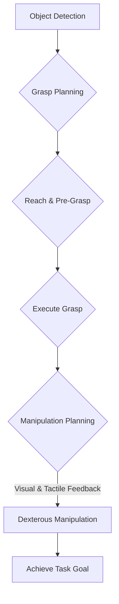

import Admonition from '@theme/Admonition';

# Chapter 7: Dexterous Manipulation and Grasping

One of the ultimate goals in robotics is to enable machines to interact with the physical world with the same dexterity and precision as humans. This capability, known as dexterous manipulation and grasping, is crucial for robots to perform complex tasks in unstructured environments. This chapter will explore the challenges and techniques involved in enabling robots to grasp and manipulate objects with finesse.

## The Challenge of Dexterous Manipulation

Dexterous manipulation involves complex movements of a robot's end-effector (often a multi-fingered hand) to reorient, reposition, and interact with objects. It goes beyond simple pick-and-place operations and requires:

-   **High Degrees of Freedom**: Multi-fingered hands have many joints, making control challenging.
-   **Force Control**: Applying the right amount of force to avoid crushing fragile objects or dropping heavy ones.
-   **Tactile Sensing**: Using touch information to infer object properties and adjust grasp.
-   **Visual Feedback**: Continuously perceiving the object and hand pose during manipulation.

<Admonition type="note" title="Human Inspiration">
Human hands are incredibly versatile, capable of both power grasps and delicate precision grasps. Replicating this in robotics is a significant engineering and AI challenge.
</Admonition>

## Grasping Techniques

Grasping is the foundational skill for manipulation. Various strategies exist:

### 1. Parallel-Jaw Grippers

Simple and robust, often used in industrial settings for grasping objects with parallel surfaces. Limited in versatility.

### 2. Multi-Fingered Hands

Offer higher dexterity and adaptability, capable of enveloping objects of various shapes. More complex to control.

### 3. Suction Grippers

Ideal for flat, smooth surfaces, often used for picking up items like electronic components or food products. Cannot grasp objects with complex geometries or porous surfaces.

## Grasp Planning

Grasp planning involves determining the optimal contact points and forces for a robot to securely hold an object. This can be model-based (using known object CAD models) or data-driven (learning from examples).

### Key Considerations in Grasp Planning

-   **Form Closure**: The grasp prevents all possible movements of the object relative to the gripper.
-   **Force Closure**: The grasp is stable even with external disturbances.
-   **Grasp Quality Metrics**: Quantifying how stable or robust a grasp is.

<Admonition type="tip" title="Uncertainty is Key">
Real-world grasping must account for uncertainty in object pose, shape, and material properties. Robust grasp planning often involves some level of compliance or adaptability.
</Admonition>

## Manipulation Strategies

Once an object is grasped, manipulation techniques come into play:

### 1. Prehensile Manipulation

Involves securely holding an object and moving it. This is typical for tasks like assembling parts or moving items.

### 2. Non-Prehensile Manipulation

Involves pushing, rolling, or sliding objects without a secure grasp. Useful for reorienting objects or moving them across a surface.

### 3. In-Hand Manipulation

Reorienting an object while it is still held within the gripper, without having to regrasp it or place it down. Requires very high dexterity.



## Sensors for Dexterous Manipulation

To achieve human-like dexterity, robots rely on a suite of sensors:

-   **Vision Sensors (Cameras)**: For object detection, pose estimation, and visual servoing.
-   **Tactile Sensors**: Provide information about contact forces, pressure distribution, and texture.
-   **Force/Torque Sensors**: Measure interaction forces at the wrist or fingertips.
-   **Proprioceptive Sensors (Encoders)**: Measure joint angles and velocities.

## Example: Learning to Grasp with Reinforcement Learning (Conceptual)

Reinforcement learning (RL) is a powerful paradigm for training robots to grasp and manipulate objects by trial and error. The robot learns a policy that maps sensor observations to actions, maximizing a reward signal (e.g., successful grasp).

```python
# Conceptual Python for RL-based Grasping Agent

class RLGraspingAgent:
    def __init__(self):
        self.policy = None # This would be a neural network in practice
        self.env = None # Simulation or real robot environment
        print("RL Grasping Agent Initialized")

    def observe_state(self):
        # Get current observation from camera, tactile sensors, joint states
        # In real-world, this would involve sensor readings
        state = {"camer-image": "...", "tactile_data": "...", "joint_angles": "..."}
        print("Observing environment state...")
        return state

    def choose_action(self, state):
        # Use the learned policy to determine grasp action (e.g., gripper pose, force)
        if self.policy is None:
            print("Policy not yet trained, choosing random action.")
            return {"gripper_open": True, "approach_vec": [0,0,-0.1], "grasp_force": 0.0}
        # In practice, policy.predict(state) would return an action
        action = {"gripper_open": False, "approach_vec": [0,0,0], "grasp_force": 10.0} # Example action
        print(f"Choosing action: {action}")
        return action

    def execute_action(self, action):
        # Send commands to robot actuators
        print(f"Executing robot action: {action}")
        # Simulate environment response, get new state and reward
        reward = 1.0 if action["grasp_force"] > 0 else 0.0 # Simplified reward
        print(f"Action executed, received reward: {reward}")
        return reward

# --- Simulation of RL training loop (simplified) ---
agent = RLGraspingAgent()

# In a real training, this loop would run for millions of steps
for episode in range(1):
    print(f"\n--- Episode {episode + 1} ---")
    current_state = agent.observe_state()
    action = agent.choose_action(current_state)
    reward = agent.execute_action(action)
    # Update policy based on state, action, reward (training step)

print("RL grasping simulation ended.")
```

Next Chapter → [Sim-to-Real Transfer Techniques](/docs/chapters/chapter-8)