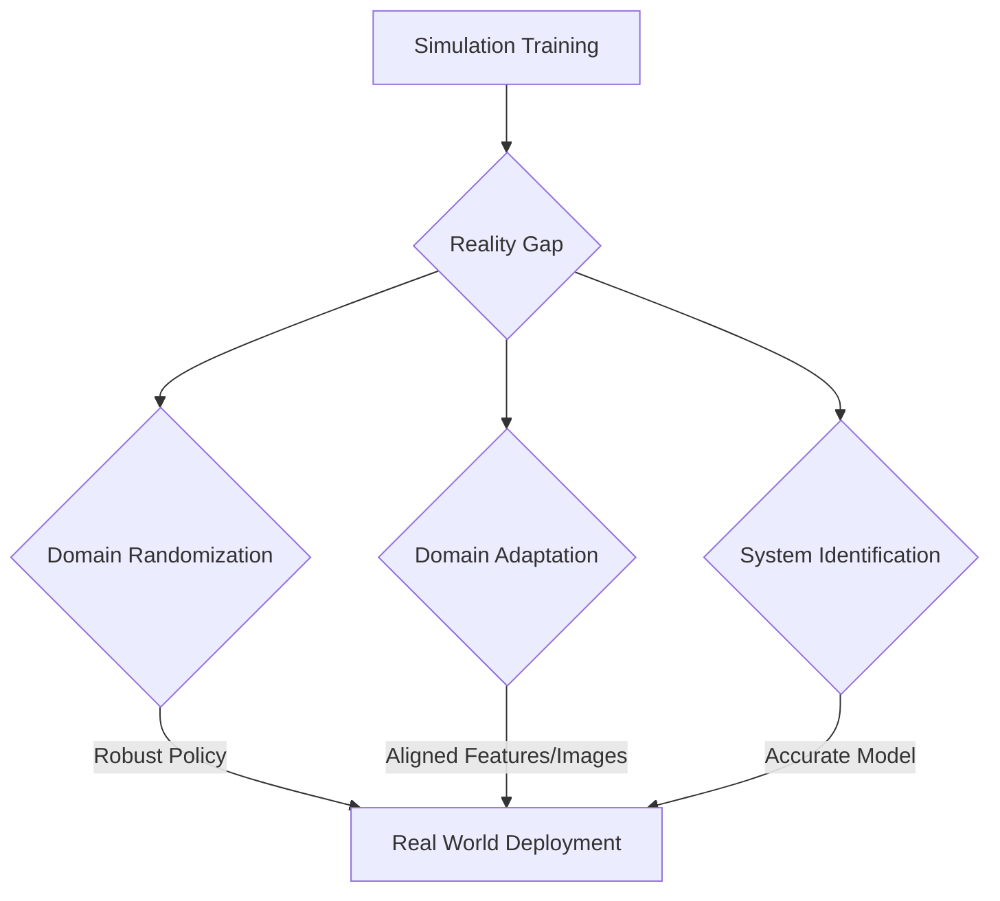

import Admonition from '@theme/Admonition';

# Chapter 8: Sim-to-Real Transfer Techniques

Simulation offers an invaluable sandbox for developing and testing robotic systems, providing safety, speed, and cost-effectiveness. However, the ultimate goal is to deploy these systems in the real world. This transition, known as sim-to-real transfer, presents significant challenges due to the inevitable discrepancies between simulated and physical environments, often referred to as the "reality gap." This chapter explores various techniques to bridge this gap and enable robust sim-to-real transfer.

## The Reality Gap

The reality gap encompasses all the differences between a simulated environment and its real-world counterpart. These discrepancies can arise from:

-   **Sensor Noise and Imperfections**: Simulated sensors are often ideal, lacking the noise, latency, and calibration issues of real sensors.
-   **Actuator Limitations**: Real motors have friction, backlash, and limited precision not always accurately modeled in simulation.
-   **Physics Discrepancies**: Subtle differences in friction coefficients, elasticity, gravity, and contact dynamics.
-   **Modeling Errors**: Inaccuracies in the geometric or material properties of objects and robots.
-   **Environmental Variations**: Lighting changes, unexpected objects, and complex textures in the real world are hard to perfectly replicate.

<Admonition type="note" title="No Perfect Simulation">
It's practically impossible to create a perfect simulation that captures every nuance of the real world. The goal of sim-to-real transfer is to make the learned policy robust enough to handle these imperfections.
</Admonition>

## Techniques for Bridging the Reality Gap

Various strategies have been developed to enhance the transferability of policies from simulation to reality.

### 1. Domain Randomization

Domain randomization involves training the robot in a simulator where certain aspects of the environment (e.g., textures, lighting, object positions, physical parameters like friction) are randomized across a wide range. By exposing the agent to diverse variations in simulation, it learns a policy that is robust to these variations, making it more likely to generalize to the real world.

<Admonition type="tip" title="Key Idea">
The core idea of domain randomization is to make the simulator so varied that the real world appears to the agent as just another variation it has seen during training.
</Admonition>

### 2. Domain Adaptation

Domain adaptation techniques aim to reduce the discrepancy between the source domain (simulation) and the target domain (real world) either by adapting the simulated data to look more like real data or by adapting the real data to be more like simulated data, or by learning domain-invariant features.

-   **Feature-level Adaptation**: Learning representations that are robust to domain shifts.
-   **Image-level Adaptation**: Using Generative Adversarial Networks (GANs) or other techniques to make rendered images from simulation look more realistic.

### 3. Progressive Training

Starts with a simpler, less realistic simulation and gradually increases its complexity and realism. This allows the robot to learn basic skills in an easy environment and then refine them as the simulation becomes more challenging.

### 4. System Identification

Involves precisely measuring the physical properties (mass, inertia, friction coefficients) of the real robot and its environment to create a more accurate simulation model. This is a foundational step for high-fidelity physics simulation.



## Sim-to-Real with Reinforcement Learning

Reinforcement Learning (RL) agents often benefit significantly from simulation due to the need for vast amounts of interaction data. Successful sim-to-real transfer for RL typically involves combining the above techniques:

-   **Training in randomized simulations**: To create a robust initial policy.
-   **Fine-tuning in the real world**: Small amounts of real-world data can be used to fine-tune the policy, often using techniques like transfer learning.
-   **Residual Policies**: Learning a simpler policy in simulation and a small "residual" policy in the real world to account for the remaining reality gap.

## Example: Domain Randomization Parameters (Conceptual)

In a simulation, when training a robot to grasp objects, you might randomize parameters such as:

-   **Object properties**: Mass, friction, restitution, color, texture.
-   **Lighting**: Position of light sources, intensity, color.
-   **Camera parameters**: Field of view, focal length, noise levels.
-   **Robot parameters**: Joint limits, motor strengths, sensor noise.

```python
# Conceptual Python for applying domain randomization

class SimEnvironment:
    def __init__(self):
        self.object_texture = "wood.jpg"
        self.light_intensity = 1.0
        self.friction_coeff = 0.5

    def randomize_parameters(self):
        # Randomize object textures
        textures = ["wood.jpg", "metal.jpg", "plastic.jpg", "random_pattern.png"]
        self.object_texture = random.choice(textures)

        # Randomize light intensity
        self.light_intensity = random.uniform(0.5, 1.5)

        # Randomize friction coefficient
        self.friction_coeff = random.uniform(0.3, 0.8)

        print(f"Randomized parameters: texture={self.object_texture}, light={self.light_intensity:.2f}, friction={self.friction_coeff:.2f}")

    def run_simulation_step(self, robot_action):
        # Simulate physics and render scene with current parameters
        pass

import random
env = SimEnvironment()

for _ in range(5): # Simulate 5 different randomized environments
    env.randomize_parameters()
    env.run_simulation_step(robot_action="some_grasp_attempt")
```

## Future Directions

Research in sim-to-real transfer continues to evolve rapidly, with focus on:

-   **Automated Domain Randomization**: Algorithms that automatically discover optimal randomization parameters.
-   **Generative Models for Simulation**: Using AI to generate more realistic and diverse simulation data.
-   **Meta-Learning for Transfer**: Learning to learn policies that transfer quickly.

Next Chapter → [Conversational Robotics & Natural Interaction](/docs/chapters/chapter-9)