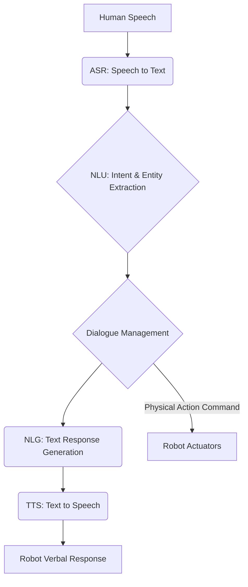

import Admonition from '@theme/Admonition';

# Chapter 9: Conversational Robotics & Natural Interaction

The ability for robots to communicate and interact naturally with humans is paramount for their widespread adoption in daily life. Conversational robotics aims to bridge the gap between human language and robot action, enabling intuitive and effective collaboration. This chapter explores the principles of conversational AI in robotics, focusing on natural language understanding, dialogue management, and generating human-like responses.

## The Need for Natural Interaction

For robots to be truly useful in human environments, they must move beyond predefined commands and engage in flexible, natural conversations. This involves:

-   **Understanding Intent**: Deciphering the user's underlying goals from spoken or typed language.
-   **Contextual Awareness**: Maintaining a coherent understanding of the conversation history and environment.
-   **Multimodal Communication**: Combining verbal cues with gestures, gaze, and other non-verbal signals.
-   **Human-like Responses**: Generating appropriate and natural language responses, including clarifications and proactive suggestions.

<Admonition type="note" title="Beyond Voice Assistants">
Conversational robotics goes beyond simple voice assistants. It integrates language processing with physical perception and action, allowing robots to understand commands related to their physical environment and execute them.
</Admonition>

## Components of a Conversational Robot System

A typical conversational robotics system integrates several AI and robotics modules:

### 1. Automatic Speech Recognition (ASR)

Converts spoken language into text. This is the first step for voice-controlled robots.

### 2. Natural Language Understanding (NLU)

Processes the text to extract meaning, identify entities (objects, locations), and determine the user's intent. This often involves techniques like named entity recognition (NER) and intent classification.

### 3. Dialogue Management

Manages the flow of conversation, tracks dialogue state, and determines the robot's next action. This involves deciding what to say, what question to ask, or what physical action to perform.

### 4. Natural Language Generation (NLG)

Generates human-like text responses from the robot's internal state or planned actions.

### 5. Text-to-Speech (TTS)

Converts the generated text back into spoken language for verbal responses.

<Admonition type="tip" title="Closed vs. Open Domain">
Conversational systems can be categorized as closed-domain (e.g., customer service chatbot for a specific product) or open-domain (e.g., a general-purpose conversational agent). Robotics often benefits from a hybrid approach.
</Admonition>

## Dialogue Management Strategies

Effective dialogue management is crucial for maintaining coherent conversations:

-   **State-based Dialogue Systems**: Explicitly track the state of the conversation and use rules or finite state machines to transition between states.
-   **Frame-based Dialogue Systems**: Fill "slots" (e.g., object, location, action) within a predefined frame to complete a task.
-   **End-to-End Neural Dialogue Systems**: Use deep learning models to directly map conversation history to responses, often more flexible but harder to control.



## Grounding Language in the Physical World

A key challenge in conversational robotics is grounding abstract language in the robot's physical environment. When a user says "Pick up that red block," the robot needs to:

1.  **Visually Identify**: Use its vision system to locate the "red block."
2.  **Referential Grounding**: Associate the linguistic term "red block" with a specific object in its perception.
3.  **Feasibility Check**: Determine if the physical action (picking up) is possible given its current state and capabilities.

## Example: ROS 2 and Conversational AI Integration (Conceptual)

Integrating conversational AI with ROS 2 involves creating nodes that handle different parts of the dialogue system and communicate with other robot control nodes via topics, services, or actions.

```python
# Conceptual ROS 2 Python Node for NLU
import rclpy
from rclpy.node import Node
from std_msgs.msg import String
from your_robot_msgs.srv import GetIntent # Custom service message

class NluNode(Node):
    def __init__(self):
        super().__init__('nlu_node')
        self.command_subscription = self.create_subscription(
            String,
            'voice_command_topic',
            self.command_callback,
            10)
        self.intent_publisher = self.create_publisher(String, 'robot_intent_topic', 10)
        self.get_logger().info('NLU Node Started')

    def command_callback(self, msg):
        text_command = msg.data
        self.get_logger().info(f'Received command: "{text_command}"')
        # In a real system, call NLU model here
        if "pick up" in text_command and "red block" in text_command:
            intent = "pick_red_block"
        else:
            intent = "unknown"
        self.intent_publisher.publish(String(data=intent))
        self.get_logger().info(f'Published intent: "{intent}"')

def main(args=None):
    rclpy.init(args=args)
    nlu_node = NluNode()
    rclpy.spin(nlu_node)
    nlu_node.destroy_node()
    rclpy.shutdown()

if __name__ == '__main__':
    main()
```

<Admonition type="warning" title="Ethical Considerations">
Developing conversational robots raises ethical concerns regarding privacy, bias in language models, and the potential for manipulation. Careful design and transparent communication are essential.
</Admonition>


Next Chapter → [Capstone – Building an Autonomous Humanoid](/docs/chapters/chapter-10)