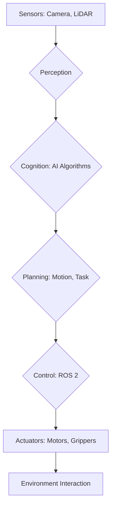

import Admonition from '@theme/Admonition';

# باب 1: فزیکل اے آئی اور جسمانی ذہانت کا تعارف

خوش آمدید اس دلچسپ دنیا میں جہاں مصنوعی ذہانت کا جسمانی دائرے سے ملن ہوتا ہے۔ یہ باب آپ کو فزیکل اے آئی اور جسمانی ذہانت کے بنیادی تصورات سے متعارف کرائے گا، جو یہ سمجھنے کے لیے بنیاد فراہم کرے گا کہ ذہین نظام ہماری جسمانی دنیا کے ساتھ کیسے تعامل کرتے اور سیکھتے ہیں۔

## فزیکل اے آئی کیا ہے؟

فزیکل اے آئی سے مراد وہ مصنوعی ذہانت کے نظام ہیں جو جسمانی ماحول میں کام کرتے اور براہ راست اس سے تعامل کرتے ہیں۔ روایتی اے آئی کے برعکس، جو اکثر صرف ڈیجیٹل جگہوں میں موجود ہوتی ہے، فزیکل اے آئی ذہانت کو جسمانی شکلوں جیسے روبوٹس، ڈرونز اور خود مختار گاڑیوں میں مجسم کرتی ہے۔ اس تعامل کے لیے فزکس، ریئل ٹائم کنٹرول، اور سینسر ڈیٹا پروسیسنگ کی گہری سمجھ کی ضرورت ہوتی ہے۔

<Admonition type="note" title="اہم فرق">
روایتی اے آئی اکثر قدرتی زبان کی پروسیسنگ یا تصویر کی شناخت جیسے علمی کاموں پر توجہ مرکاز کرتی ہے۔ فزیکل اے آئی جسمانی موجودگی، حرکت، اور تعامل کے جہتوں کو شامل کرکے اس کو وسعت دیتی ہے۔
</Admonition>

## جسمانی ذہانت

جسمانی ذہانت اے آئی کا ایک ذیلی شعبہ ہے جو ذہانت کی نشوونما میں جسمانی جسم اور ماحول کے ساتھ اس کے تعامل کے کردار پر زور دیتا ہے۔ خیال یہ ہے کہ ایک ایجنٹ کی ذہانت صرف اس کے دماغ کی پیداوار نہیں ہے، بلکہ اس کے جسم اور دنیا میں اس کے تجربات کی بھی ہے۔

### جسمانیت کی اہمیت

- **بنیاد**: جسمانیت تجریدی تصورات کو ٹھوس جسمانی تجربات میں بنیاد فراہم کرنے میں مدد کرتی ہے۔
- **تعامل**: جسمانی تعامل ہیرا پھیری، دریافت، اور آزمائش و غلطی کے ذریعے سیکھنے کی اجازت دیتا ہے۔
- **ادراک**: ایک جسمانی جسم ماحول کو سمجھنے کے لیے اہم منفرد نقطہ نظر اور حسی ان پٹ فراہم کرتا ہے۔

<Admonition type="tip" title="اس بارے میں سوچیں">
غور کریں کہ ایک بچہ دنیا کے بارے میں کیسے سیکھتا ہے۔ وہ صرف معلومات پر کارروائی نہیں کرتا؛ وہ چھوتا ہے، پکڑتا ہے، گرتا ہے، اور تجربات کرتا ہے، جسمانی تجربات کے ذریعے ذہانت پیدا کرتا ہے۔
</Admonition>

## تاریخی پس منظر اور ارتقاء

جسمانی دنیا کے ساتھ تعامل کرنے والی ذہین مشینوں کا تصور ابتدائی سائبرنیٹکس سے تعلق رکھتا ہے۔ تاہم، روبوٹکس، مشین لرننگ، اور کمپیوٹیشنل طاقت میں حالیہ ترقی نے فزیکل اے آئی کے شعبے کو تیز کیا ہے۔

### جسمانی اے آئی میں سنگ میل

- **ابتدائی روبوٹکس**: سادہ مینیپولیٹرز اور صنعتی روبوٹس۔
- **ری ایکٹیو آرکیٹیکچرز**: روڈنی بروکس کا سب سمپشن آرکیٹیکچر۔
- **لرننگ پر مبنی روبوٹکس**: کنٹرول اور ہیرا پھیری کے لیے ری انفورسمنٹ لرننگ۔
- **ہیومینائیڈ روبوٹکس**: انسانی شکل اور صلاحیتوں کی نقل کرنے والے روبوٹس کی ترقی۔

## فزیکل اے آئی سسٹمز کے اجزاء

ایک عام فزیکل اے آئی سسٹم کئی اہم اجزاء کو مربوط کرتا ہے:

1.  **ادراک**: ماحول سے ڈیٹا جمع کرنے کے لیے سینسرز (کیمرے، LiDAR، فورس سینسرز)۔
2.  **علمی**: سینسر ڈیٹا پر کارروائی کرنے اور فیصلے کرنے کے لیے اے آئی الگورتھم (مشین لرننگ، منصوبہ بندی)۔
3.  **عمل**: جسمانی حرکات کو انجام دینے کے لیے ایکچویٹرز (موٹرز، گریپرز)۔
4.  **کنٹرول**: ان اجزاء کو منظم اور مربوط کرنے کے لیے سافٹ ویئر فریم ورکس (جیسے ROS 2)۔

## مثال: ایک سادہ روبوٹک آرم کنٹرول

آئیے ایک چیز کو اٹھانے کے لیے ایک روبوٹک بازو کو کنٹرول کرنے کی ایک بنیادی مثال پر غور کریں۔ اس میں شامل ہے:

-   **ادراک**: ایک کیمرہ چیز کی پوزیشن کی شناخت کرتا ہے۔
-   **علمی**: ایک اے آئی الگورتھم چیز تک پہنچنے اور اسے پکڑنے کے لیے بازو کے راستے کا تعین کرتا ہے۔
-   **عمل**: بازو میں موٹرز اسے حسابی پوزیشن پر منتقل کرتی ہیں۔
-   **کنٹرول**: ROS 2 نوڈز کیمرہ ڈرائیور، اے آئی پلانر، اور بازو کے موٹر کنٹرولرز کے درمیان مواصلت کرتی ہے۔

```python
# Basic ROS 2 Python example (conceptual)
import rclpy
from rclpy.node import Node
from geometry_msgs.msg import PoseStamped

class ArmController(Node):
    def __init__(self):
        super().__init__('arm_controller')
        self.publisher_ = self.create_publisher(PoseStamped, 'target_pose', 10)
        self.get_logger().info('Arm Controller Node Started')

    def move_arm_to_pose(self, x, y, z):
        msg = PoseStamped()
        msg.header.frame_id = 'base_link'
        msg.pose.position.x = x
        msg.pose.position.y = y
        msg.pose.position.z = z
        self.publisher_.publish(msg)
        self.get_logger().info(f'Published target pose: ({x}, {y}, {z})')

def main(args=None):
    rclpy.init(args=args)
    arm_controller = ArmController()
    arm_controller.move_arm_to_pose(0.5, 0.1, 0.3) # Example target pose
    rclpy.spin_once(arm_controller, timeout_sec=1.0)
    arm_controller.destroy_node()
    rclpy.shutdown()

if __name__ == '__main__':
    main()
```

## فزیکل اے آئی کا مستقبل

یہ شعبہ تیزی سے ترقی کر رہا ہے، جس میں مزید خود مختار، قابل موافقت، اور انسانی جیسے روبوٹس کی طرف رجحانات ہیں۔ جدید اے آئی ماڈلز، جیسے کہ بڑے لسانی ماڈلز (LLMs) اور وژن-لسانی-عمل (VLA) ماڈلز کا انضمام، ایسے روبوٹس کا وعدہ کرتا ہے جو پیچیدہ کمانڈز کو سمجھ سکتے ہیں، نئی مہارتیں سیکھ سکتے ہیں، اور غیر منظم ماحول میں کام کر سکتے ہیں۔



اگلا باب → [روبوٹک اعصابی نظام - ROS 2 کی گہرائی](/chapters/chapter-2)