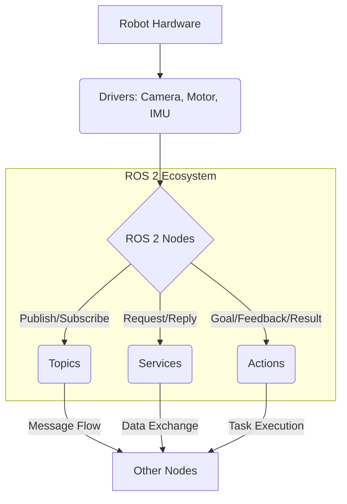

import Admonition from '@theme/Admonition';

# باب 2: روبوٹک اعصابی نظام – ROS 2 گہری نظر

روبوٹکس کی دنیا میں، روبوٹ آپریٹنگ سسٹم (ROS) مرکزی اعصابی نظام کے طور پر کام کرتا ہے، جو سافٹ ویئر ڈویلپرز کو روبوٹ ایپلی کیشنز بنانے میں مدد کے لیے لائبریریاں اور ٹولز فراہم کرتا ہے۔ یہ باب ROS 2، اس کے فن تعمیر، بنیادی تصورات، اور یہ کس طرح پیچیدہ روبوٹک سسٹمز کی ترقی کو آسان بناتا ہے، پر گہری نظر ڈالے گا۔

## ROS 2 کیا ہے؟

ROS 2 روبوٹس کے لیے ایک اوپن سورس، میٹا-آپریٹنگ سسٹم ہے۔ یہ روبوٹ سافٹ ویئر لکھنے کے لیے ایک لچکدار فریم ورک فراہم کرتا ہے۔ یہ ٹولز، لائبریریوں، اور کنونشنز کا ایک مجموعہ ہے جس کا مقصد مختلف قسم کے روبوٹک پلیٹ فارمز پر پیچیدہ اور مضبوط روبوٹ رویے بنانے کے کام کو آسان بنانا ہے۔

<Admonition type="note" title="ROS 1 سے ارتقاء">
ROS 2 کو ROS 1 سے دوبارہ ڈیزائن کیا گیا تاکہ جدید روبوٹکس کی ضروریات کو پورا کیا جا سکے، جس میں متعدد روبوٹس، ریئل ٹائم کنٹرول، اور ایمبیڈڈ سسٹمز کے لیے سپورٹ شامل ہے، جو اسے پیداواری سطح کی تعیناتیوں کے لیے زیادہ موزوں بناتا ہے۔
</Admonition>

## ROS 2 بنیادی تصورات

ROS 2 کو سمجھنا اس کے بنیادی تصورات کو سمجھنے سے شروع ہوتا ہے:

### 1. نوڈز

نوڈز قابل عمل عمل ہیں جو حساب کتاب کرتے ہیں۔ انہیں ماڈیولر ہونے کے لیے ڈیزائن کیا گیا ہے، ہر نوڈ ایک مقصد کے لیے ذمہ دار ہے (مثلاً، ایک کیمرہ ڈرائیور نوڈ، ایک موٹر کنٹرول نوڈ، ایک پاتھ پلاننگ نوڈ)۔

### 2. ٹاپکس

ٹاپکس نامی بسیں ہیں جن پر نوڈز پیغامات کا تبادلہ کرتے ہیں۔ ایک نوڈ ایک ٹاپک پر پیغامات شائع کر سکتا ہے، اور دوسرے نوڈز پیغامات وصول کرنے کے لیے اس ٹاپک کو سبسکرائب کر سکتے ہیں۔ یہ پبلش/سبسکرائب میکانزم غیر ہم آہنگ اور غیر مربوط ہے۔

### 3. سروسز

سروسز نوڈز کے درمیان درخواست/جواب کا میکانزم فراہم کرتی ہیں۔ ٹاپکس کے برعکس، جو یک طرفہ سلسلے ہیں، سروسز نوڈز کو ایک درخواست بھیجنے اور ایک واحد جواب وصول کرنے کی اجازت دیتی ہیں۔ یہ ان فعالیتوں کے لیے مفید ہے جن کے لیے براہ راست جواب کی ضرورت ہوتی ہے، جیسے کسی مخصوص عمل کو متحرک کرنا۔

### 4. ایکشنز

ایکشنز سروسز کی طرح ہیں لیکن طویل عرصے تک چلنے والے، ہدف پر مبنی تعاملات فراہم کرتی ہیں۔ وہ کلائنٹس کو ایک ہدف بھیجنے، مسلسل فیڈ بیک وصول کرنے، اور ہدف کو منسوخ کرنے کی اجازت دیتی ہیں۔ یہ کسی مخصوص مقام پر نیویگیٹ کرنے یا پیچیدہ ہیرا پھیری انجام دینے جیسے کاموں کے لیے مثالی ہے۔

### 5. پیرامیٹرز

پیرامیٹرز وہ اقدار ہیں جو نوڈز اسٹارٹ اپ پر لوڈ کر سکتے ہیں یا رن ٹائم کے دوران ترمیم کر سکتے ہیں۔ انہیں کوڈ کو دوبارہ مرتب کیے بغیر نوڈ کے رویے کو ترتیب دینے کے لیے استعمال کیا جاتا ہے۔

<Admonition type="tip" title="ماڈیولر ڈیزائن">
ROS 2 کی خوبصورتی اس کی ماڈیولریٹی میں مضمر ہے۔ آپ مختلف زبانوں میں لکھے گئے مختلف نوڈز کو ملا کر پیچیدہ روبوٹ رویے بنا سکتے ہیں بغیر کم سطح کے مواصلات کی تفصیلات کی فکر کیے۔
</Admonition>

## ROS 2 فن تعمیر کا جائزہ



## عملی مثال: ایک سادہ ROS 2 پبلشر اور سبسکرائبر بنانا

آئیے دو ROS 2 نوڈز کی ایک سادہ پائتھون مثال بنائیں: ایک بات کرنے والا (پبلشر) اور ایک سننے والا (سبسکرائبر)۔

### پبلشر نوڈ (`simple_publisher.py`)

```python
import rclpy
from rclpy.node import Node
from std_msgs.msg import String

class SimplePublisher(Node):
    def __init__(self):
        super().__init__('simple_publisher')
        self.publisher_ = self.create_publisher(String, 'my_topic', 10)
        timer_period = 1.0  # seconds
        self.timer = self.create_timer(timer_period, self.timer_callback)
        self.i = 0
        self.get_logger().info('Simple Publisher Node Started')

    def timer_callback(self):
        msg = String()
        msg.data = f'Hello ROS 2: {self.i}'
        self.publisher_.publish(msg)
        self.get_logger().info(f'Publishing: "{msg.data}"')
        self.i += 1

def main(args=None):
    rclpy.init(args=args)
    simple_publisher = SimplePublisher()
    rclpy.spin(simple_publisher)
    simple_publisher.destroy_node()
    rclpy.shutdown()

if __name__ == '__main__':
    main()
```

### سبسکرائبر نوڈ (`simple_subscriber.py`)

```python
import rclpy
from rclpy.node import Node
from std_msgs.msg import String

class SimpleSubscriber(Node):
    def __init__(self):
        super().__init__('simple_subscriber')
        self.subscription = self.create_subscription(
            String,
            'my_topic',
            self.listener_callback,
            10)
        self.subscription  # prevent unused variable warning
        self.get_logger().info('Simple Subscriber Node Started')

    def listener_callback(self, msg):
        self.get_logger().info(f'I heard: "{msg.data}"')

def main(args=None):
    rclpy.init(args=args)
    simple_subscriber = SimpleSubscriber()
    rclpy.spin(simple_subscriber)
    simple_subscriber.destroy_node()
    rclpy.shutdown()

if __name__ == '__main__':
    main()
```

ان مثالوں کو چلانے کے لیے:

1.  کوڈ کو ROS 2 پیکیج میں محفوظ کریں۔
2.  پبلشر چلائیں: `ros2 run your_package_name simple_publisher`
3.  دوسرے ٹرمینل میں سبسکرائبر چلائیں: `ros2 run your_package_name simple_subscriber`

## ہارڈ ویئر کے ساتھ انٹرفیسنگ

ROS 2 مختلف روبوٹک ہارڈ ویئر اجزاء کے ساتھ انٹرفیس کرنے کے لیے مختلف پیکجز اور ڈرائیور فراہم کرتا ہے۔ یہ ڈویلپرز کو کم سطح کی ہارڈ ویئر مواصلات کو خلاصہ کرنے اور اعلی سطح کے روبوٹ رویوں پر توجہ مرکوز کرنے کی اجازت دیتا ہے۔

### عام ہارڈ ویئر انٹرفیس:

-   **سینسرز**: کیمرے، LiDARs، IMUs، انکوڈرز۔
-   **ایکچویٹرز**: موٹرز، سرووس، گریپرز۔
-   **روبوٹک بازو**: یونیورسل روبوٹس، فرینکا ایمیکا۔
-   **موبائل پلیٹ فارمز**: ٹرٹل بوٹ، کسٹم پہیوں والے روبوٹس۔

اگلا باب → [ڈیجیٹل ٹوئنز – گزیبو اور یونٹی کے ساتھ سمولیشن](/chapters/chapter-3)