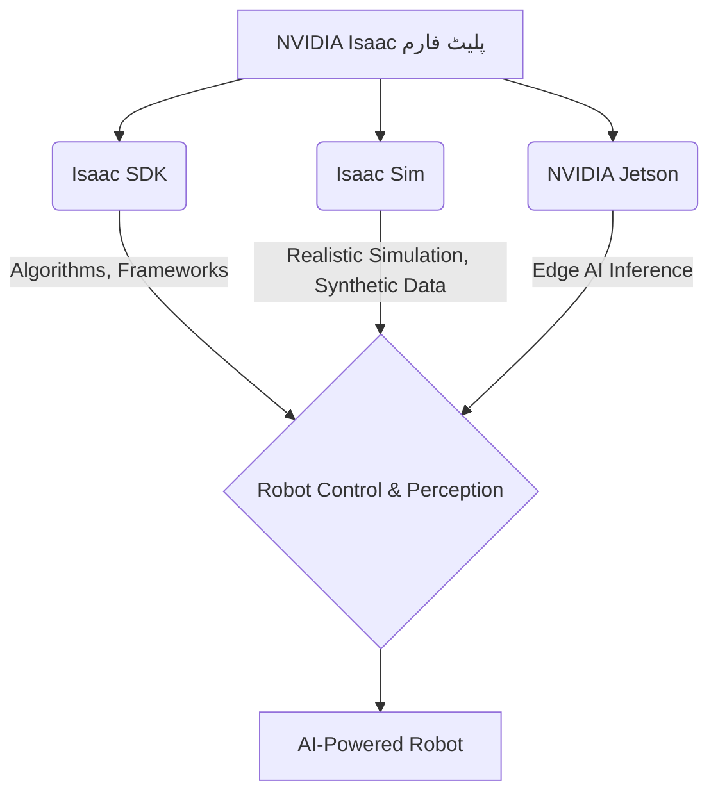

import Admonition from '@theme/Admonition';

# باب 4: NVIDIA Isaac پلیٹ فارم – روبوٹس کے لیے AI دماغ

واقعی ذہین اور خود مختار روبوٹس بنانے کے لیے، طاقتور کمپیوٹیشنل پلیٹ فارمز ضروری ہیں۔ NVIDIA کا Isaac پلیٹ فارم AI سے چلنے والے روبوٹس کو تیار کرنے، سمیولیٹ کرنے، اور تعینات کرنے کے لیے ٹولز، SDKs، اور ہارڈ ویئر ایکسلریشن کا ایک جامع سویٹ فراہم کرتا ہے۔ یہ باب NVIDIA Isaac پلیٹ فارم کے مختلف اجزاء اور یہ جدید روبوٹکس کے لیے AI دماغ کے طور پر کیسے کام کرتا ہے، پر گہری نظر ڈالے گا۔

## NVIDIA Isaac کیا ہے؟

NVIDIA Isaac ایک روبوٹکس پلیٹ فارم ہے جو AI سے چلنے والے روبوٹس کی ترقی اور تعیناتی کو تیز کرتا ہے۔ یہ NVIDIA کی AI، گرافکس، اور سمولیشن میں مہارت کو یکجا کرتا ہے تاکہ ڈویلپرز کو خود مختار مشینوں کی اگلی نسل بنانے کے لیے ایک طاقتور ماحولیاتی نظام فراہم کیا جا سکے۔

<Admonition type="note" title="متحد ماحولیاتی نظام">
Isaac صرف ایک سافٹ ویئر ٹول کٹ نہیں ہے؛ یہ ایک جامع پلیٹ فارم ہے جس میں ہارڈ ویئر (جیٹسن، RTX GPUs)، سافٹ ویئر (SDKs، سمولیشن ٹولز)، اور روبوٹکس کی ترقی کے لیے ایک بھرپور ماحولیاتی نظام شامل ہے۔
</Admonition>

## Isaac پلیٹ فارم کے اہم اجزاء

### 1. Isaac SDK

Isaac SDK ایک سافٹ ویئر ڈویلپمنٹ کٹ ہے جو روبوٹ کی سمجھ، نیویگیشن، اور ہیرا پھیری کے لیے الگورتھم، فریم ورکس، اور ٹولز کا ایک مجموعہ فراہم کرتا ہے۔ یہ ایک ماڈیولر فن تعمیر پر بنایا گیا ہے، جو ڈویلپرز کو اپنی روبوٹک ایپلی کیشنز میں مختلف AI صلاحیتوں کو مربوط کرنے کی اجازت دیتا ہے۔

### 2. Isaac Sim

Isaac Sim ایک قابل توسیع روبوٹکس سمولیشن ایپلی کیشن ہے جو NVIDIA Omniverse پر بنائی گئی ہے۔ یہ AI سے چلنے والے روبوٹس کو تیار کرنے، جانچنے، اور تربیت دینے کے لیے ایک فزیکی طور پر درست مجازی ماحول فراہم کرتا ہے۔ Isaac Sim کے ساتھ، ڈویلپرز روبوٹس اور ان کے ماحول کے حقیقت پسندانہ ڈیجیٹل ٹوئنز بنا سکتے ہیں، جو تیز رفتار تکرار اور مصنوعی ڈیٹا جنریشن کو ممکن بناتا ہے۔

### 3. NVIDIA Jetson پلیٹ فارم

جیٹسن ایمبیڈڈ کمپیوٹنگ بورڈز کی ایک سیریز ہے جو کنارے پر AI کے لیے ڈیزائن کی گئی ہے۔ یہ کمپیکٹ، بجلی کی بچت کرنے والے ماڈیولز GPU-ایکسلریٹڈ AI صلاحیتوں کو براہ راست روبوٹس تک لاتے ہیں، جو روبوٹ پر ہی ریئل ٹائم سمجھ، نتیجہ، اور کنٹرول کو ممکن بناتے ہیں۔

### 4. Omniverse

NVIDIA Omniverse 3D ڈیزائن تعاون اور سمولیشن کے لیے ایک پلیٹ فارم ہے۔ Isaac Sim اومنیورس کا فائدہ اٹھاتا ہے تاکہ ایک بھرپور، فزیکی طور پر درست سمولیشن ماحول فراہم کیا جا سکے۔ یہ مختلف 3D ٹولز اور ایپلی کیشنز کے درمیان بغیر کسی رکاوٹ کے ڈیٹا ایکسچینج اور تعاون کی اجازت دیتا ہے۔

<Admonition type="tip" title="متحد ترقی">
Isaac پلیٹ فارم کا مقصد ڈیزائن اور سمولیشن سے لے کر تعیناتی تک ترقیاتی ورک فلو کو متحد کرنا ہے، جس سے روبوٹکس میں رگڑ کو کم کیا جا سکے اور جدت کو تیز کیا جا سکے گی۔
</Admonition>

## مصنوعی ڈیٹا جنریشن کے لیے Isaac Sim

Isaac Sim کی سب سے طاقتور خصوصیات میں سے ایک اس کی مصنوعی ڈیٹا تیار کرنے کی صلاحیت ہے۔ حقیقی دنیا کے ڈیٹا کے ساتھ AI ماڈلز کی تربیت مہنگی اور وقت طلب ہو سکتی ہے۔ Isaac Sim ڈویلپرز کو ایک مجازی ماحول میں وسیع مقدار میں متنوع، لیبل شدہ ڈیٹا بنانے کی اجازت دیتا ہے، جسے پھر حقیقی دنیا کی تعیناتی کے لیے مضبوط AI ماڈلز کی تربیت کے لیے استعمال کیا جا سکتا ہے۔

### مصنوعی ڈیٹا کیوں؟

- **قابل توسیع**: لاکھوں متنوع ڈیٹا نمونے تیزی سے تیار کریں۔
- **وضاحت**: کامل، پکسل سطح کی وضاحتیں خود بخود دستیاب ہیں۔
- **مختلف قسم**: نایاب واقعات یا انتہائی حالات کو آسانی سے سمیولیٹ کریں۔
- **لاگت کی تاثیر**: دستی ڈیٹا اکٹھا کرنے اور لیبل لگانے کی ضرورت کو کم کریں۔

## مثال: Isaac SDK کے ساتھ AI نیویگیشن (تصوری)

ایک روبوٹ کا تصور کریں جو اندرونی ماحول میں نیویگیٹ کر رہا ہے۔ Isaac SDK کے لیے اجزاء فراہم کرتا ہے:

-   **SLAM (Simultaneous Localization and Mapping)**: LiDAR جیسے سینسرز کا استعمال کرتے ہوئے ماحول کا نقشہ بنانا جبکہ بیک وقت روبوٹ کو اس کے اندر تلاش کرنا۔
-   **پاتھ پلاننگ**: روبوٹ کے موجودہ مقام سے ہدف کی منزل تک ایک بہترین، تصادم سے پاک راستہ کا تعین کرنے کے لیے الگورتھم۔
-   **رکاوٹ سے بچنا**: سینسرز کے ذریعے پتہ چلنے والی متحرک رکاوٹوں کی بنیاد پر راستے میں ریئل ٹائم ایڈجسٹمنٹ۔

## Isaac کے ساتھ تعیناتی

سمولیشن میں تیار اور جانچ کیے جانے کے بعد، روبوٹک ایپلی کیشنز کو Isaac SDK اور Jetson پلیٹ فارمز کا استعمال کرتے ہوئے فزیکل روبوٹس پر تعینات کیا جا سکتا ہے۔ ہموار انٹیگریشن مجازی پروٹوٹائپنگ سے حقیقی دنیا کے آپریشن میں ایک ہموار منتقلی کی اجازت دیتا ہے۔

اگلا باب → [ویژن-زبان-عمل (VLA) ماڈلز](/chapters/chapter-5)