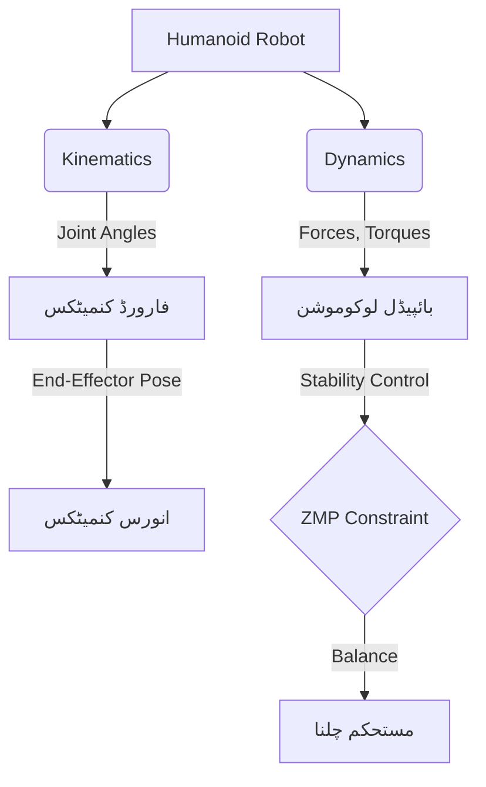

import Admonition from '@theme/Admonition';

# باب 6: ہیومینائیڈ کنمیٹکس اور بائپیڈل لوکوموشن

ہیومینائیڈ روبوٹس، اپنی انسانی شکل کے ساتھ، روبوٹکس میں ایک بڑا چیلنج پیش کرتے ہیں۔ انہیں دو پیروں پر خوبصورتی اور استحکام کے ساتھ حرکت کرنے، اور ماحول کے ساتھ مہارت سے تعامل کرنے کے قابل بنانے کے لیے کنمیٹکس، ڈائنامکس، اور جدید کنٹرول کی حکمت عملیوں کی گہری سمجھ کی ضرورت ہوتی ہے۔ یہ باب ہیومینائیڈ کنمیٹکس کے اصولوں اور بائپیڈل لوکوموشن کی پیچیدگیوں پر گہری نظر ڈالے گا۔

## ہیومینائیڈ روبوٹکس کا تعارف

ہیومینائیڈ روبوٹس کو انسانی جسم کی نقل کرنے کے لیے ڈیزائن کیا گیا ہے، جس میں دو بازو، دو ٹانگیں، اور ایک دھڑ ہوتا ہے، اکثر ایک سر کے ساتھ۔ ان کا ڈیزائن انہیں انسانی مرکز ماحول میں کام کرنے کی اجازت دیتا ہے، جو انہیں گھروں، دفاتر، اور یہاں تک کہ آفات زدہ علاقوں میں بھی کاموں کے لیے موزوں بناتا ہے۔

<Admonition type="note" title="مشابہت سے آگے">
یہ صرف انسانوں کی طرح نظر آنے کے بارے میں نہیں ہے؛ یہ انسانی شکل کے فوائد کو استعمال کرنے کے بارے میں ہے تاکہ انسانوں کے لیے بنائے گئے ماحول میں تعامل، ہیرا پھیری، اور نیویگیشن کو آسان بنایا جا سکے۔
</Admonition>

## کنمیٹکس: روبوٹ کی حرکت کو سمجھنا

کنمیٹکس حرکت کا مطالعہ ہے بغیر ان قوتوں پر غور کیے جو اسے پیدا کرتی ہیں۔ ہیومینائیڈ روبوٹس کے لیے، اس میں شامل ہے:

### 1. فارورڈ کنمیٹکس

جوائنٹ اینگلز دیے جانے پر روبوٹ کے اینڈ-ایفیکٹرز (مثلاً، ہاتھ، پاؤں) کی پوزیشن اور اورینٹیشن کا حساب لگاتا ہے۔ یہ روبوٹ کے لنک لینتھ اور جوائنٹ کنفیگریشنز کی بنیاد پر ایک سیدھا ریاضیاتی حساب ہے۔

### 2. انورس کنمیٹکس (IK)

مطلوبہ اینڈ-ایفیکٹر پوزیشن اور اورینٹیشن حاصل کرنے کے لیے درکار جوائنٹ اینگلز کا تعین کرتا ہے۔ IK زیادہ پیچیدہ ہے کیونکہ اس میں اکثر غیر لکیری مساوات کو حل کرنا شامل ہوتا ہے اور اس کے متعدد حل یا کوئی حل نہیں ہو سکتا۔

### کنمیٹک چینز

ہیومینائیڈز بنیادی طور پر پیچیدہ کنمیٹک چینز ہیں۔ ہر عضو جوائنٹس سے منسلک لنکس کی ایک سیریز ہے، جو حرکت کی ایک وسیع رینج کی اجازت دیتا ہے۔

<Admonition type="tip" title="آزادی کی ڈگری">
ایک روبوٹک سسٹم کی تشکیل کو بیان کرنے والے آزاد پیرامیٹرز کی تعداد کو اس کی آزادی کی ڈگریاں (DoF) کہتے ہیں۔ ہیومینائیڈز میں عام طور پر بہت سی DoF ہوتی ہیں، جو ان کے کنٹرول کو مشکل بناتی ہیں۔
</Admonition>

## بائپیڈل لوکوموشن: چلنے کا فن

دو پیروں پر چلنا (بائپیڈل لوکوموشن) ایک انتہائی پیچیدہ متحرک عمل ہے۔ پہیوں والے روبوٹس کے برعکس، ہیومینائیڈز کو حرکت کرتے ہوئے کشش ثقل کے خلاف مسلسل توازن برقرار رکھنا پڑتا ہے۔ اہم تصورات میں شامل ہیں:

### 1. زیرو مومنٹ پوائنٹ (ZMP)

ZMP بائپیڈل لوکوموشن میں ایک بنیادی تصور ہے۔ یہ زمین پر وہ نقطہ ہے جس کے بارے میں فعال قوتوں (کشش ثقل، جڑتا) کے تمام لمحوں کا مجموعہ صفر ہوتا ہے۔ مستحکم چلنے کے لیے، ZMP کو سپورٹ پولیگون (زمین کے ساتھ پیروں کے رابطے کے پوائنٹس سے متعین علاقہ) کے اندر رہنا چاہیے۔

### 2. چلنے کی چالیں اور پیٹرن

مختلف چلنے کی چالیں استعمال کی جاتی ہیں، جامد چلنے (جہاں ZMP ہمیشہ سپورٹ پولیگون کے اندر ہوتا ہے) سے لے کر متحرک چلنے (جہاں روبوٹ جان بوجھ کر غیر مستحکم ہوتا ہے، حرکت کرنے کے لیے رفتار کا استعمال کرتا ہے) تک۔

### 3. توازن اور استحکام کنٹرول

توازن برقرار رکھنے کے لیے مسلسل حسی فیڈ بیک (IMUs، فورس سینسرز) اور جوائنٹ ٹارکس کا فعال کنٹرول ضروری ہے۔ کنٹرولرز کو ناہموار علاقے، بیرونی خلل، اور رفتار میں تبدیلیوں کے مطابق ڈھالنا چاہیے۔



## ہیومینائیڈ روبوٹس کے لیے کنٹرول کی حکمت عملی

مؤثر بائپیڈل لوکوموشن جدید کنٹرول الگورتھم پر منحصر ہے:

-   **ٹرائجیکٹری جنریشن**: روبوٹ کے مرکزِ کمیت اور پیروں کے لیے ہموار اور مستحکم راستوں کی منصوبہ بندی کرنا۔
-   **ہول-باڈی کنٹرول**: مطلوبہ حرکات کو حاصل کرنے اور توازن برقرار رکھنے کے لیے تمام جوائنٹس اور اعضاء کو بیک وقت مربوط کرنا۔
-   **امپیڈنس کنٹرول**: روبوٹ کو بیرونی قوتوں پر لچکدار طریقے سے رد عمل ظاہر کرنے کی اجازت دینا، جسمانی تعامل کے لیے اہم۔

## مثال: سادہ بائپیڈل توازن (تصوری)

جبکہ مکمل بائپیڈل لوکوموشن پیچیدہ ہے، ایک سادہ کنٹرول لوپ میں IMU کا استعمال کرتے ہوئے جھکاؤ کے زاویوں کا پتہ لگانا اور روبوٹ کے مرکزِ کمیت کو مستحکم پوزیشن پر واپس لانے کے لیے ٹخنوں یا کولہوں کے جوائنٹس کو ایڈجسٹ کرنا شامل ہو سکتا ہے۔

```python
# Conceptual Python for simple bipedal balance (simplified)
import time

class SimpleBipedalController:
    def __init__(self):
        self.imu_lean_angle = 0.0 # Simulate IMU reading
        self.ankle_joint_angle = 0.0 # Simulate ankle motor position
        self.gain = 0.1 # Control gain
        print("Simple Bipedal Controller Initialized")

    def read_imu(self):
        # In a real robot, read from IMU sensor
        # For simulation, let's assume some lean for testing
        self.imu_lean_angle = 5.0 # Example: robot leaning 5 degrees
        print(f"IMU detected lean angle: {self.imu_lean_angle} degrees")

    def adjust_balance(self):
        if abs(self.imu_lean_angle) > 1.0: # If lean is significant
            correction = -self.gain * self.imu_lean_angle
            self.ankle_joint_angle += correction
            print(f"Adjusting ankle by {correction:.2f} degrees. New ankle angle: {self.ankle_joint_angle:.2f}")
        else:
            print("Robot is stable, no adjustment needed.")

# --- Simulation of balance loop ---
controller = SimpleBipedalController()

for i in range(5):
    print(f"\nIteration {i+1}:")
    controller.read_imu()
    controller.adjust_balance()
    time.sleep(0.5)

print("Balance control simulation ended.")
```

<Admonition type="warning" title="اعلیٰ پیچیدگی">
ہیومینائیڈز کے لیے مضبوط بائپیڈل لوکوموشن تیار کرنا روبوٹکس کے سب سے مشکل شعبوں میں سے ایک ہے، جس کے لیے جدید ریاضیاتی ماڈلنگ، کنٹرول تھیوری، اور وسیع تجرباتی توثیق کی ضرورت ہوتی ہے۔
</Admonition>

اگلا باب → [مہارت سے ہیرا پھیری اور پکڑنا](/chapters/chapter-7)