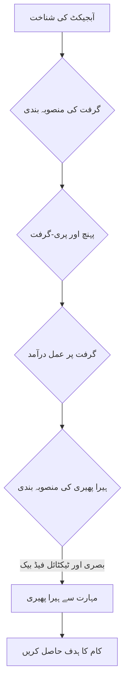

import Admonition from '@theme/Admonition';

# باب 7: مہارت سے ہیرا پھیری اور پکڑنا

روبوٹکس میں ایک حتمی ہدف مشینوں کو جسمانی دنیا کے ساتھ انسانوں جیسی مہارت اور درستگی کے ساتھ تعامل کرنے کے قابل بنانا ہے۔ یہ صلاحیت، جسے مہارت سے ہیرا پھیری اور پکڑنا کہا جاتا ہے، روبوٹس کے لیے غیر منظم ماحول میں پیچیدہ کام انجام دینے کے لیے اہم ہے۔ یہ باب روبوٹس کو مہارت سے اشیاء کو پکڑنے اور ہیرا پھیری کرنے کے قابل بنانے میں شامل چیلنجز اور تکنیکوں کو تلاش کرے گا۔

## مہارت سے ہیرا پھیری کا چیلنج

مہارت سے ہیرا پھیری میں روبوٹ کے اینڈ-ایفیکٹر (اکثر کثیر انگلیوں والا ہاتھ) کی پیچیدہ حرکتیں شامل ہوتی ہیں تاکہ اشیاء کو دوبارہ ترتیب دیا جا سکے، دوبارہ پوزیشن میں لایا جا سکے، اور ان کے ساتھ تعامل کیا جا سکے۔ یہ سادہ چننے اور رکھنے کے آپریشنز سے آگے بڑھتا ہے اور اس کی ضرورت ہوتی ہے:

-   **آزادی کی اعلیٰ ڈگریاں**: کثیر انگلیوں والے ہاتھوں میں بہت سے جوائنٹس ہوتے ہیں، جو کنٹرول کو مشکل بناتے ہیں۔
-   **فورس کنٹرول**: نازک اشیاء کو کچلنے یا بھاری اشیاء کو گرانے سے بچنے کے لیے صحیح مقدار میں قوت لگانا۔
-   **ٹیکٹائل سینسنگ**: اشیاء کی خصوصیات کا اندازہ لگانے اور گرفت کو ایڈجسٹ کرنے کے لیے ٹچ معلومات کا استعمال کرنا۔
-   **بصری فیڈ بیک**: ہیرا پھیری کے دوران آبجیکٹ اور ہاتھ کی پوزیشن کو مسلسل محسوس کرنا۔

<Admonition type="note" title="انسانی الہام">
انسانی ہاتھ ناقابل یقین حد تک ورسٹائل ہوتے ہیں، جو طاقتور گرفت اور نازک درستگی والی گرفت دونوں کے قابل ہوتے ہیں۔ روبوٹکس میں اس کی نقل کرنا ایک اہم انجینئرنگ اور AI چیلنج ہے۔
</Admonition>

## پکڑنے کی تکنیکیں

پکڑنا ہیرا پھیری کے لیے بنیادی مہارت ہے۔ مختلف حکمت عملییں موجود ہیں:

### 1. پیرل-جا گریپرز

سادہ اور مضبوط، اکثر صنعتی ترتیبات میں متوازی سطحوں والی اشیاء کو پکڑنے کے لیے استعمال ہوتا ہے۔ ورسٹائل میں محدود۔

### 2. کثیر انگلیوں والے ہاتھ

اعلیٰ مہارت اور موافقت پیش کرتے ہیں، جو مختلف شکلوں کی اشیاء کو گھیرنے کے قابل ہوتے ہیں۔ کنٹرول کرنا زیادہ پیچیدہ۔

### 3. سکشن گریپرز

ہموار، ہموار سطحوں کے لیے مثالی، اکثر الیکٹرانک اجزاء یا کھانے کی اشیاء جیسی اشیاء کو اٹھانے کے لیے استعمال ہوتا ہے۔ پیچیدہ جیومیٹریوں یا سوراخ دار سطحوں والی اشیاء کو نہیں پکڑ سکتا۔

## گرفت کی منصوبہ بندی

گرفت کی منصوبہ بندی میں روبوٹ کے لیے کسی چیز کو محفوظ طریقے سے پکڑنے کے لیے بہترین رابطے کے پوائنٹس اور قوتوں کا تعین کرنا شامل ہے۔ یہ ماڈل پر مبنی (معلوم آبجیکٹ CAD ماڈلز کا استعمال کرتے ہوئے) یا ڈیٹا پر مبنی (مثالوں سے سیکھنا) ہو سکتا ہے۔

### گرفت کی منصوبہ بندی میں اہم تحفظات

-   **فارم کلوژر**: گرفت گریپر کے نسبت آبجیکٹ کی تمام ممکنہ حرکتوں کو روکتی ہے۔
-   **فورس کلوژر**: گرفت بیرونی خلل کے ساتھ بھی مستحکم ہوتی ہے۔
-   **گرفت کے معیار کے میٹرکس**: یہ مقدار کو بیان کرنا کہ گرفت کتنی مستحکم یا مضبوط ہے۔

<Admonition type="tip" title="غیر یقینی کلیدی ہے">
حقیقی دنیا کی گرفت میں آبجیکٹ کی پوزیشن، شکل، اور مادی خصوصیات میں غیر یقینی صورتحال کو مدنظر رکھنا چاہیے۔ مضبوط گرفت کی منصوبہ بندی میں اکثر کچھ سطح کی تعمیل یا موافقت شامل ہوتی ہے۔
</Admonition>

## ہیرا پھیری کی حکمت عملی

ایک بار جب کوئی چیز پکڑ لی جاتی ہے، تو ہیرا پھیری کی تکنیکیں عمل میں آتی ہیں:

### 1. پری ہینسیل ہیرا پھیری

کسی چیز کو محفوظ طریقے سے پکڑنا اور اسے حرکت دینا شامل ہے۔ یہ پرزوں کو جمع کرنے یا اشیاء کو حرکت دینے جیسے کاموں کے لیے عام ہے۔

### 2. غیر پری ہینسیل ہیرا پھیری

محفوظ گرفت کے بغیر اشیاء کو دھکیلنا، رول کرنا، یا سلائیڈ کرنا شامل ہے۔ اشیاء کو دوبارہ ترتیب دینے یا انہیں سطح پر حرکت دینے کے لیے مفید ہے۔

### 3. ہاتھ میں ہیرا پھیری

کسی چیز کو گریپر کے اندر پکڑے ہوئے دوبارہ ترتیب دینا، بغیر اسے دوبارہ پکڑنے یا نیچے رکھنے کے۔ اس کے لیے بہت زیادہ مہارت کی ضرورت ہوتی ہے۔



## مہارت سے ہیرا پھیری کے لیے سینسرز

انسانوں جیسی مہارت حاصل کرنے کے لیے، روبوٹس سینسرز کے ایک سویٹ پر انحصار کرتے ہیں:

-   **وژن سینسرز (کیمرے)**: آبجیکٹ کی شناخت، پوزیشن کا تخمینہ، اور بصری سروونگ کے لیے۔
-   **ٹیکٹائل سینسرز**: رابطے کی قوتوں، دباؤ کی تقسیم، اور ساخت کے بارے میں معلومات فراہم کرتے ہیں۔
-   **فورس/ٹارک سینسرز**: کلائی یا انگلیوں پر تعامل کی قوتوں کی پیمائش کرتے ہیں۔
-   **پروپریوسیپٹیو سینسرز (انکوڈرز)**: جوائنٹ اینگلز اور رفتار کی پیمائش کرتے ہیں۔

## مثال: کمک سیکھنے کے ساتھ پکڑنا سیکھنا (تصوری)

کمک سیکھنا (RL) روبوٹس کو آزمائش اور غلطی سے اشیاء کو پکڑنے اور ہیرا پھیری کرنے کی تربیت دینے کے لیے ایک طاقتور پیراڈائم ہے۔ روبوٹ ایک ایسی پالیسی سیکھتا ہے جو سینسر کے مشاہدات کو اعمال سے نقشہ بناتی ہے، جس سے ایک انعام کے سگنل (مثلاً، کامیاب گرفت) کو زیادہ سے زیادہ کیا جاتا ہے۔

```python
# Conceptual Python for RL-based Grasping Agent

class RLGraspingAgent:
    def __init__(self):
        print("RL Grasping Agent Initialized")

    def observe_state(self):
        # Get current observation from camera, tactile sensors, joint states
        # In real-world, this would involve sensor readings
        state = {"camer-image": "...", "tactile_data": "...", "joint_angles": "..."}
        print("Observing environment state...")
        return state

    def choose_action(self, state):
        # Use the learned policy to determine grasp action (e.g., gripper pose, force)
        if self.policy is None:
            print("Policy not yet trained, choosing random action.")
            return {"gripper_open": True, "approach_vec": [0,0,-0.1], "grasp_force": 0.0}
        # In practice, policy.predict(state) would return an action
        action = {"gripper_open": False, "approach_vec": [0,0,0], "grasp_force": 10.0} # Example action
        print(f"Choosing action: {action}")
        return action

    def execute_action(self, action):
        # Send commands to robot actuators
        print(f"Executing robot action: {action}")
        # Simulate environment response, get new state and reward
        reward = 1.0 if action["grasp_force"] > 0 else 0.0 # Simplified reward
        print(f"Action executed, received reward: {reward}")
        return reward

# --- Simulation of RL training loop (simplified) ---
agent = RLGraspingAgent()

# In a real training, this loop would run for millions of steps
for episode in range(1):
    print(f"\n--- Episode {episode + 1} ---")
    current_state = agent.observe_state()
    action = agent.choose_action(current_state)
    reward = agent.execute_action(action)
    # Update policy based on state, action, reward (training step)

print("RL grasping simulation ended.")
```

اگلا باب → [سم-ٹو-ریئل ٹرانسفر تکنیکیں](/chapters/chapter-8)