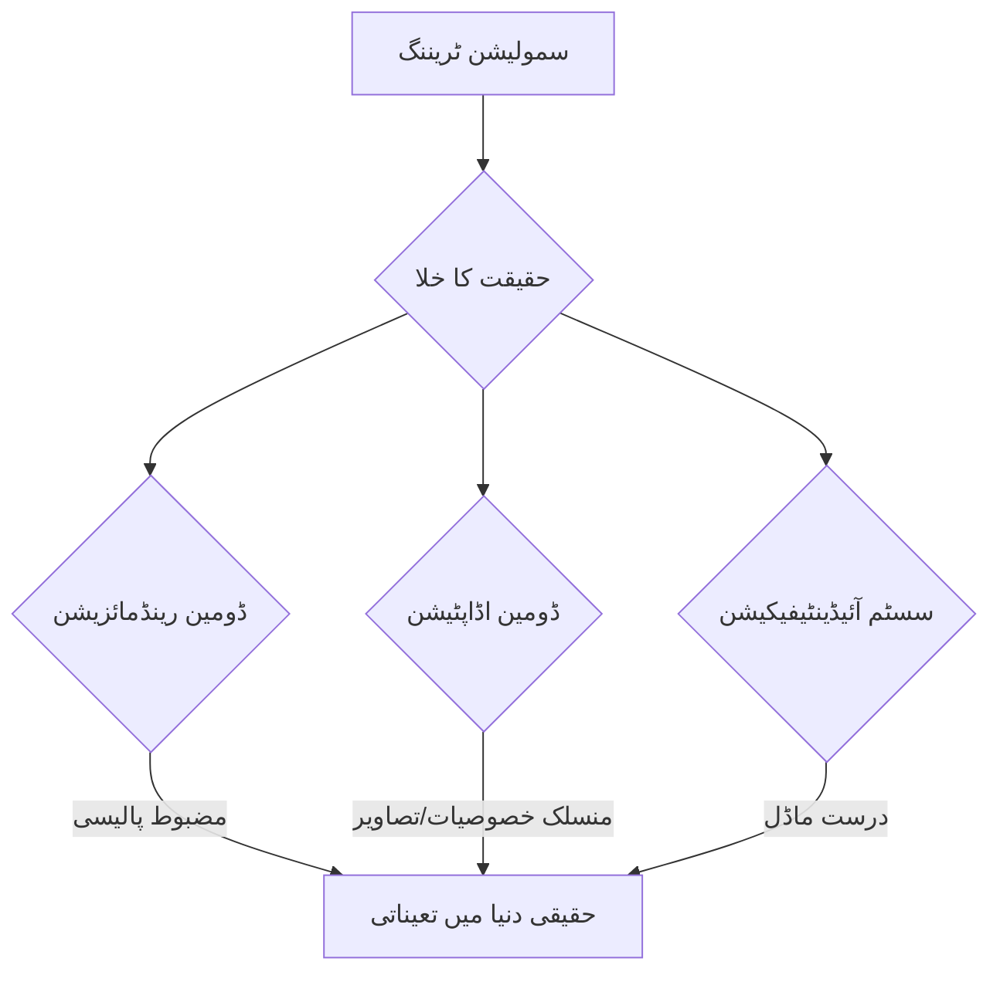

import Admonition from '@theme/Admonition';

# باب 8: سم-ٹو-ریئل ٹرانسفر تکنیکیں

سمولیشن روبوٹک سسٹمز کو تیار کرنے اور جانچنے کے لیے ایک انمول ریت کا ڈبہ پیش کرتا ہے، جو حفاظت، رفتار، اور لاگت کی تاثیر فراہم کرتا ہے۔ تاہم، حتمی ہدف ان سسٹمز کو حقیقی دنیا میں تعینات کرنا ہے۔ یہ منتقلی، جسے سم-ٹو-ریئل ٹرانسفر کے نام سے جانا جاتا ہے، سمیولیٹڈ اور فزیکل ماحول کے درمیان ناگزیر تضادات کی وجہ سے اہم چیلنجز پیش کرتا ہے، جسے اکثر "حقیقت کا خلا" کہا جاتا ہے۔ یہ باب اس خلا کو پر کرنے اور مضبوط سم-ٹو-ریئل ٹرانسفر کو ممکن بنانے کے لیے مختلف تکنیکوں کو تلاش کرتا ہے۔

## حقیقت کا خلا

حقیقت کا خلا ایک سمیولیٹڈ ماحول اور اس کے حقیقی دنیا کے ہم منصب کے درمیان تمام اختلافات کو گھیرتا ہے۔ یہ تضادات اس سے پیدا ہو سکتے ہیں:

-   **سینسر کا شور اور خامیاں**: سمیولیٹڈ سینسر اکثر مثالی ہوتے ہیں، حقیقی سینسرز کے شور، تاخیر، اور کیلیبریشن کے مسائل کی کمی ہوتی ہے۔
-   **ایکچویٹر کی حدود**: حقیقی موٹرز میں رگڑ، بیکلیش، اور محدود درستگی ہوتی ہے جسے سمولیشن میں ہمیشہ درست طریقے سے ماڈل نہیں کیا جاتا۔
-   **فزکس کے تضادات**: رگڑ کے گتانک، لچک، کشش ثقل، اور رابطے کی حرکیات میں لطیف اختلافات۔
-   **ماڈلنگ کی غلطیاں**: اشیاء اور روبوٹس کی جیومیٹرک یا مادی خصوصیات میں غلطیاں۔
-   **ماحولیاتی تغیرات**: حقیقی دنیا میں روشنی کی تبدیلیاں، غیر متوقع اشیاء، اور پیچیدہ بناوٹ کو مکمل طور پر نقل کرنا مشکل ہے۔

<Admonition type="note" title="کوئی کامل سمولیشن نہیں">
ایک کامل سمولیشن بنانا عملی طور پر ناممکن ہے جو حقیقی دنیا کی ہر نزاکت کو حاصل کر سکے۔ سم-ٹو-ریئل ٹرانسفر کا مقصد سیکھی ہوئی پالیسی کو اتنا مضبوط بنانا ہے کہ وہ ان خامیوں کو سنبھال سکے۔
</Admonition>

## حقیقت کے خلا کو پر کرنے کے لیے تکنیکیں

سیمولیشن سے حقیقت میں پالیسیوں کی منتقلی کو بڑھانے کے لیے مختلف حکمت عملییں تیار کی گئی ہیں۔

### 1. ڈومین رینڈمائزیشن

ڈومین رینڈمائزیشن میں ایک سمیلیٹر میں روبوٹ کو تربیت دینا شامل ہے جہاں ماحول کے بعض پہلوؤں (مثلاً، بناوٹ، روشنی، آبجیکٹ کی پوزیشن، رگڑ جیسے فزیکل پیرامیٹرز) کو ایک وسیع رینج میں بے ترتیب کیا جاتا ہے۔ ایجنٹ کو سمولیشن میں متنوع تغیرات سے روشناس کر کے، وہ ایک ایسی پالیسی سیکھتا ہے جو ان تغیرات کے لیے مضبوط ہوتی ہے، جس سے اس کے حقیقی دنیا میں عام ہونے کا امکان زیادہ ہوتا ہے۔

<Admonition type="tip" title="بنیادی خیال">
ڈومین رینڈمائزیشن کا بنیادی خیال یہ ہے کہ سمیلیٹر کو اتنا متنوع بنایا جائے کہ حقیقی دنیا ایجنٹ کو تربیت کے دوران دیکھی گئی ایک اور تغیر کے طور پر نظر آئے۔
</Admonition>

### 2. ڈومین اڈاپٹیشن

ڈومین اڈاپٹیشن کی تکنیکوں کا مقصد سورس ڈومین (سمولیشن) اور ٹارگٹ ڈومین (حقیقی دنیا) کے درمیان تضاد کو کم کرنا ہے یا تو سمیولیٹڈ ڈیٹا کو حقیقی ڈیٹا کی طرح دکھانے کے لیے ڈھال کر یا حقیقی ڈیٹا کو سمیولیٹڈ ڈیٹا کی طرح بنانے کے لیے ڈھال کر، یا ڈومین-انورینٹ خصوصیات سیکھ کر۔

-   **فیچر-سطح کی اڈاپٹیشن**: نمائندگی سیکھنا جو ڈومین کی تبدیلیوں کے لیے مضبوط ہو۔
-   **تصویر-سطح کی اڈاپٹیشن**: جنریٹو ایڈورسریئل نیٹ ورکس (GANs) یا دیگر تکنیکوں کا استعمال کرتے ہوئے سمولیشن سے رینڈر کردہ تصاویر کو زیادہ حقیقت پسندانہ بنانا۔

### 3. پروگریسیو ٹریننگ

ایک آسان، کم حقیقت پسندانہ سمولیشن سے شروع ہوتا ہے اور آہستہ آہستہ اس کی پیچیدگی اور حقیقت پسندی کو بڑھاتا ہے۔ یہ روبوٹ کو ایک آسان ماحول میں بنیادی مہارتیں سیکھنے اور پھر سمولیشن کے زیادہ مشکل ہونے کے ساتھ انہیں بہتر بنانے کی اجازت دیتا ہے۔

### 4. سسٹم آئیڈینٹیفیکیشن

حقیقی روبوٹ اور اس کے ماحول کی فزیکل خصوصیات (ماس، جڑتا، رگڑ کے گتانک) کی درست پیمائش کرنا شامل ہے تاکہ ایک زیادہ درست سمولیشن ماڈل بنایا جا سکے۔ یہ اعلیٰ وفاداری والی فزکس سمولیشن کے لیے ایک بنیادی قدم ہے۔



## کمک سیکھنے کے ساتھ سم-ٹو-ریئل

کمک سیکھنے (RL) کے ایجنٹس اکثر سمولیشن سے نمایاں طور پر فائدہ اٹھاتے ہیں کیونکہ انہیں وسیع مقدار میں تعامل کے ڈیٹا کی ضرورت ہوتی ہے۔ RL کے لیے کامیاب سم-ٹو-ریئل ٹرانسفر میں عام طور پر مندرجہ بالا تکنیکوں کو یکجا کرنا شامل ہوتا ہے:

-   **بے ترتیب سمولیشنز میں تربیت**: ایک مضبوط ابتدائی پالیسی بنانے کے لیے۔
-   **حقیقی دنیا میں فائن-ٹیوننگ**: حقیقی دنیا کے ڈیٹا کی چھوٹی مقدار کو پالیسی کو بہتر بنانے کے لیے استعمال کیا جا سکتا ہے، اکثر ٹرانسفر لرننگ جیسی تکنیکوں کا استعمال کرتے ہوئے۔
-   **ریزیڈوئل پالیسیاں**: سمولیشن میں ایک آسان پالیسی اور حقیقی دنیا میں ایک چھوٹی "ریزیڈوئل" پالیسی سیکھنا تاکہ باقی حقیقت کے خلا کو پورا کیا جا سکے۔

## مثال: ڈومین رینڈمائزیشن پیرامیٹرز (تصوری)

ایک سمولیشن میں، روبوٹ کو اشیاء کو پکڑنے کی تربیت دیتے وقت، آپ پیرامیٹرز کو بے ترتیب کر سکتے ہیں جیسے:

-   **آبجیکٹ کی خصوصیات**: ماس، رگڑ، بحالی، رنگ، بناوٹ۔
-   **روشنی**: روشنی کے ذرائع کی پوزیشن، شدت، رنگ۔
-   **کیمرہ پیرامیٹرز**: فیلڈ آف ویو، فوکل لینتھ، شور کی سطح۔
-   **روبوٹ پیرامیٹرز**: جوائنٹ کی حدود، موٹر کی طاقت، سینسر کا شور۔

```python
# Conceptual Python for applying domain randomization

class SimEnvironment:
    def __init__(self):
        self.object_texture = "wood.jpg"
        self.light_intensity = 1.0
        self.friction_coeff = 0.5

    def randomize_parameters(self):
        # Randomize object textures
        textures = ["wood.jpg", "metal.jpg", "plastic.jpg", "random_pattern.png"]
        self.object_texture = random.choice(textures)

        # Randomize light intensity
        self.light_intensity = random.uniform(0.5, 1.5)

        # Randomize friction coefficient
        self.friction_coeff = random.uniform(0.3, 0.8)

        print(f"Randomized parameters: texture={self.object_texture}, light={self.light_intensity:.2f}, friction={self.friction_coeff:.2f}")

    def run_simulation_step(self, robot_action):
        # Simulate physics and render scene with current parameters
        pass

import random
env = SimEnvironment()

for _ in range(5): # Simulate 5 different randomized environments
    env.randomize_parameters()
    env.run_simulation_step(robot_action="some_grasp_attempt")
```

## مستقبل کی سمتیں

سم-ٹو-ریئل ٹرانسفر میں تحقیق تیزی سے ترقی کر رہی ہے، جس میں توجہ مرکوز ہے:

-   **خودکار ڈومین رینڈمائزیشن**: ایسے الگورتھم جو بہترین رینڈمائزیشن پیرامیٹرز کو خود بخود دریافت کرتے ہیں۔
-   **سمولیشن کے لیے جنریٹو ماڈلز**: زیادہ حقیقت پسندانہ اور متنوع سمولیشن ڈیٹا تیار کرنے کے لیے AI کا استعمال کرنا۔
-   **منتقلی کے لیے میٹا-لرننگ**: ایسی پالیسیاں سیکھنا جو تیزی سے منتقل ہوتی ہیں۔

اگلا باب → [بات چیت کرنے والے روبوٹکس اور قدرتی تعامل](/chapters/chapter-9)