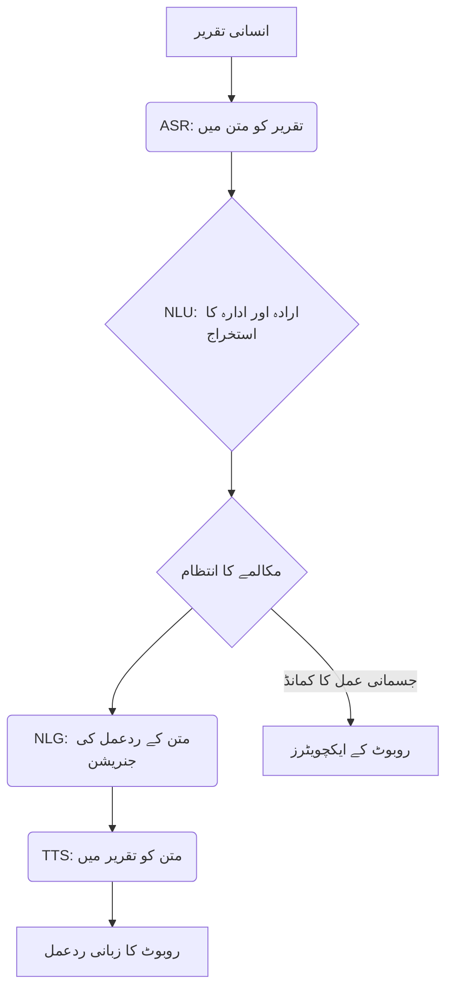

import Admonition from '@theme/Admonition';

# باب 9: بات چیت کرنے والے روبوٹکس اور قدرتی تعامل

روبوٹس کے لیے انسانوں کے ساتھ فطری طور پر بات چیت اور تعامل کرنے کی صلاحیت روزمرہ کی زندگی میں ان کے وسیع استعمال کے لیے انتہائی اہم ہے۔ بات چیت کرنے والے روبوٹکس کا مقصد انسانی زبان اور روبوٹ کی کارروائی کے درمیان کے فاصلے کو پر کرنا ہے، جو بدیہی اور موثر تعاون کو ممکن بناتا ہے۔ یہ باب روبوٹکس میں بات چیت کرنے والے AI کے اصولوں کو تلاش کرتا ہے، جس میں قدرتی زبان کی سمجھ، مکالمے کے انتظام، اور انسانی جیسی ردعمل پیدا کرنے پر توجہ دی جاتی ہے۔

## قدرتی تعامل کی ضرورت

روبوٹس کو انسانی ماحول میں صحیح معنوں میں مفید ہونے کے لیے، انہیں پہلے سے طے شدہ کمانڈز سے آگے بڑھ کر لچکدار، قدرتی گفتگو میں شامل ہونا چاہیے۔ اس میں شامل ہے:

-   **مقصد کو سمجھنا**: بولی یا ٹائپ شدہ زبان سے صارف کے بنیادی اہداف کو سمجھنا۔
-   **متنی آگاہی**: گفتگو کی تاریخ اور ماحول کی ایک ہم آہنگ سمجھ کو برقرار رکھنا۔
-   **ملٹی موڈل مواصلات**: زبانی اشاروں کو اشاروں، نظروں، اور دیگر غیر زبانی اشاروں کے ساتھ ملانا۔
-   **انسانی جیسے ردعمل**: مناسب اور قدرتی زبان کے ردعمل پیدا کرنا، بشمول وضاحتیں اور فعال تجاویز۔

<Admonition type="note" title="آواز کے معاونین سے آگے">
بات چیت کرنے والے روبوٹکس سادہ آواز کے معاونین سے آگے بڑھتا ہے۔ یہ زبان کی پروسیسنگ کو جسمانی تصور اور عمل کے ساتھ مربوط کرتا ہے، جس سے روبوٹس کو اپنے جسمانی ماحول سے متعلق کمانڈز کو سمجھنے اور انہیں انجام دینے کی اجازت ملتی ہے۔
</Admonition>

## بات چیت کرنے والے روبوٹ سسٹم کے اجزاء

ایک عام بات چیت کرنے والا روبوٹکس سسٹم کئی AI اور روبوٹکس ماڈیولز کو مربوط کرتا ہے:

### 1. خودکار تقریری شناخت (ASR)

بولی جانے والی زبان کو متن میں تبدیل کرتا ہے۔ یہ آواز سے کنٹرول شدہ روبوٹس کے لیے پہلا قدم ہے۔

### 2. قدرتی زبان کی سمجھ (NLU)

متن کو پروسیس کرتا ہے تاکہ معنی نکالے، اداروں (اشیاء، مقامات) کی شناخت کرے، اور صارف کے ارادے کا تعین کرے۔ اس میں اکثر نامی ادارہ کی شناخت (NER) اور ارادے کی درجہ بندی جیسی تکنیکیں شامل ہوتی ہیں۔

### 3. مکالمے کا انتظام

گفتگو کے بہاؤ کا انتظام کرتا ہے، مکالمے کی حالت کو ٹریک کرتا ہے، اور روبوٹ کی اگلی کارروائی کا تعین کرتا ہے۔ اس میں یہ فیصلہ کرنا شامل ہے کہ کیا کہنا ہے، کون سا سوال پوچھنا ہے، یا کون سا جسمانی عمل انجام دینا ہے۔

### 4. قدرتی زبان کی جنریشن (NLG)

روبوٹ کی اندرونی حالت یا منصوبہ بند اعمال سے انسانی جیسی متن کے ردعمل پیدا کرتا ہے۔

### 5. ٹیکسٹ-ٹو-اسپیچ (TTS)

پیدا شدہ متن کو زبانی ردعمل کے لیے دوبارہ بولی جانے والی زبان میں تبدیل کرتا ہے۔

<Admonition type="tip" title="بند بمقابلہ اوپن ڈومین">
بات چیت کرنے والے سسٹمز کو بند ڈومین (مثلاً، کسی مخصوص پروڈکٹ کے لیے کسٹمر سروس چیٹ بوٹ) یا اوپن ڈومین (مثلاً، ایک عام مقصد کا بات چیت کرنے والا ایجنٹ) کے طور پر درجہ بند کیا جا سکتا ہے۔ روبوٹکس اکثر ایک ہائبرڈ نقطہ نظر سے فائدہ اٹھاتا ہے۔
</Admonition>

## مکالمے کے انتظام کی حکمت عملی

ہم آہنگ گفتگو کو برقرار رکھنے کے لیے موثر مکالمے کا انتظام انتہائی اہم ہے:

-   **سٹیٹ پر مبنی مکالمے کے سسٹمز**: گفتگو کی حالت کو واضح طور پر ٹریک کریں اور ریاستوں کے درمیان منتقلی کے لیے قواعد یا فائنائٹ سٹیٹ مشینیں استعمال کریں۔
-   **فریم پر مبنی مکالمے کے سسٹمز**: کسی کام کو مکمل کرنے کے لیے ایک پہلے سے طے شدہ فریم کے اندر "سلاٹس" (مثلاً، آبجیکٹ، مقام، عمل) کو بھریں۔
-   **اینڈ-ٹو-اینڈ نیورل مکالمے کے سسٹمز**: گہری سیکھنے کے ماڈلز کا استعمال کرتے ہوئے گفتگو کی تاریخ کو براہ راست ردعمل سے نقشہ بنانا، جو اکثر زیادہ لچکدار لیکن کنٹرول کرنا مشکل ہوتا ہے۔



## جسمانی دنیا میں زبان کو بنیاد بنانا

بات چیت کرنے والے روبوٹکس میں ایک اہم چیلنج روبوٹ کے جسمانی ماحول میں تجریدی زبان کو بنیاد بنانا ہے۔ جب کوئی صارف کہتا ہے "وہ سرخ بلاک اٹھاؤ،" تو روبوٹ کو یہ کرنے کی ضرورت ہوتی ہے:

1.  **بصری طور پر شناخت کرنا**: اپنے وژن سسٹم کا استعمال کرتے ہوئے "سرخ بلاک" کا پتہ لگانا۔
2.  **حوالہ جاتی بنیاد**: لسانی اصطلاح "سرخ بلاک" کو اپنے تصور میں ایک مخصوص آبجیکٹ کے ساتھ جوڑنا۔
3.  **ممکنہ جانچ**: یہ تعین کرنا کہ آیا جسمانی عمل (اٹھانا) اس کی موجودہ حالت اور صلاحیتوں کو دیکھتے ہوئے ممکن ہے۔

## مثال: ROS 2 اور بات چیت کرنے والے AI انٹیگریشن (تصوری)

ROS 2 کے ساتھ بات چیت کرنے والے AI کو مربوط کرنے میں ایسے نوڈز بنانا شامل ہے جو مکالمے کے نظام کے مختلف حصوں کو سنبھالتے ہیں اور ٹاپکس، سروسز، یا اعمال کے ذریعے دوسرے روبوٹ کنٹرول نوڈز کے ساتھ بات چیت کرتے ہیں۔

```python
# Conceptual ROS 2 Python Node for NLU
import rclpy
from rclpy.node import Node
from std_msgs.msg import String
from your_robot_msgs.srv import GetIntent # Custom service message

class NluNode(Node):
    def __init__(self):
        super().__init__('nlu_node')
        self.command_subscription = self.create_subscription(
            String,
            'voice_command_topic',
            self.command_callback,
            10)
        self.intent_publisher = self.create_publisher(String, 'robot_intent_topic', 10)
        self.get_logger().info('NLU Node Started')

    def command_callback(self, msg):
        text_command = msg.data
        self.get_logger().info(f'Received command: "{text_command}"')
        # In a real system, call NLU model here
        if "pick up" in text_command and "red block" in text_command:
            intent = "pick_red_block"
        else:
            intent = "unknown"
        self.intent_publisher.publish(String(data=intent))
        self.get_logger().info(f'Published intent: "{intent}"')

def main(args=None):
    rclpy.init(args=args)
    nlu_node = NluNode()
    rclpy.spin(nlu_node)
    nlu_node.destroy_node()
    rclpy.shutdown()

if __name__ == '__main__':
    main()
```

<Admonition type="warning" title="اخلاقی تحفظات">
بات چیت کرنے والے روبوٹس تیار کرنا پرائیویسی، زبان کے ماڈلز میں تعصب، اور ہیرا پھیری کے امکانات سے متعلق اخلاقی خدشات کو جنم دیتا ہے۔ محتاط ڈیزائن اور شفاف مواصلات ضروری ہیں۔
</Admonition>


اگلا باب → [کیپ سٹون – ایک خود مختار ہیومینائیڈ بنانا](/chapters/chapter-10)